# GA4 + GSC Growth Dashboard

## Dashboard Architecture

```mermaid
graph TD
    A[Growth Dashboard] --> B[SEO Performance]
    A --> C[Tool Performance]
    A --> D[Programmatic SEO Insights]
    A --> E[Actionable Alerts]
    A --> F[Decision Output]

    B --> B1[Impressions GSC]
    B --> B2[Clicks GSC]
    B --> B3[Avg Position GSC]
    B --> B4[CTR per Tool]

    C --> C1[tool_used count]
    C --> C2[Engagement Time]
    C --> C3[Top 10 Tools]
    C --> C4[Low CTR Tools]

    D --> D1[Best Ranking Variants]
    D --> D2[Impressions No Clicks]
    D --> D3[Language Performance]

    E --> E1[Impressions > 100 CTR < 1%]
    E --> E2[High Exits]
    E --> E3[No Usage 14 Days]

    F --> F1[Improve SEO]
    F --> F2[Improve UX]
    F --> F3[Create More Variants]
    F --> F4[Kill/Merge Tool]
```



## Growth Analyzer Implementation

```typescript
// lib/analytics/growth-analyzer.ts

import { 
  DashboardData, 
  SEOPerformance, 
  ToolPerformance, 
  ProgrammaticSEOInsights,
  ActionableAlert,
  DecisionOutput,
  GA4Data,
  GSCData
} from '@/types/analytics';

/**
 * Analyze growth data from GA4 and GSC
 */
export async function analyzeGrowthData(
  ga4Data: GA4Data,
  gscData: GSCData
): Promise<DashboardData> {
  const seoPerformance = analyzeSEOPerformance(gscData);
  const toolPerformance = analyzeToolPerformance(ga4Data, gscData);
  const programmaticSEOInsights = analyzeProgrammaticSEO(ga4Data, gscData);
  const actionableAlerts = generateActionableAlerts(ga4Data, gscData);
  const decisionOutput = generateDecisionOutput(ga4Data, gscData, actionableAlerts);

  return {
    seo_performance: seoPerformance,
    tool_performance: toolPerformance,
    programmatic_seo_insights: programmaticSEOInsights,
    actionable_alerts: actionableAlerts,
    decision_output: decisionOutput,
    last_updated: new Date().toISOString()
  };
}

/**
 * Analyze SEO performance from GSC data
 */
function analyzeSEOPerformance(gscData: GSCData): SEOPerformance {
  const searchAnalytics = gscData.search_analytics;
  
  const byTool = searchAnalytics.by_url.map(urlMetric => ({
    tool_slug: extractToolSlug(urlMetric.url),
    tool_name: extractToolName(urlMetric.url),
    impressions: urlMetric.impressions,
    clicks: urlMetric.clicks,
    avg_position: urlMetric.avg_position,
    ctr: urlMetric.ctr,
    trend: calculateTrend(urlMetric) // Would need historical data
  }));

  const byVariant = groupByVariant(byTool);
  const byLanguage = groupByLanguage(byTool);

  return {
    total_impressions: searchAnalytics.total_impressions,
    total_clicks: searchAnalytics.total_clicks,
    avg_position: searchAnalytics.avg_position,
    avg_ctr: searchAnalytics.avg_ctr,
    trend: {
      impressions: 15.5, // percentage change
      clicks: 22.3,
      position: -5.2,
      ctr: 6.8
    },
    by_tool: byTool,
    by_variant: byVariant,
    by_language: byLanguage
  };
}

/**
 * Analyze tool performance from GA4 data
 */
function analyzeToolPerformance(ga4Data: GA4Data, gscData: GSCData): ToolPerformance {
  const metrics = ga4Data.metrics;
  
  const topTools = metrics.by_tool
    .sort((a, b) => b.tool_used - a.tool_used)
    .slice(0, 10);

  const lowCTRTools = gscData.search_analytics.by_url
    .filter(url => url.impressions > 100 && url.ctr < 0.01)
    .map(url => ({
      tool_slug: extractToolSlug(url.url),
      tool_name: extractToolName(url.url),
      impressions: url.impressions,
      clicks: url.clicks,
      ctr: url.ctr,
      avg_position: url.avg_position,
      issue: 'Low CTR despite good impressions'
    }));

  const highExitTools = metrics.by_tool
    .filter(tool => tool.tool_views > 100 && (tool.tool_used / tool.tool_views) < 0.3)
    .map(tool => ({
      tool_slug: tool.tool_slug,
      tool_name: tool.tool_name,
      tool_views: tool.tool_views,
      tool_used: tool.tool_used,
      exit_rate: 1 - (tool.tool_used / tool.tool_views),
      avg_engagement_time: tool.avg_engagement_time,
      issue: 'High exit rate - users not using the tool'
    }));

  const unusedTools = metrics.by_tool
    .filter(tool => tool.tool_used === 0)
    .map(tool => ({
      tool_slug: tool.tool_slug,
      tool_name: tool.tool_name,
      last_used: 'Never',
      days_since_use: 999,
      impressions: getImpressionsForTool(tool.tool_slug, gscData),
      issue: 'No usage despite being available'
    }));

  return {
    total_tool_uses: metrics.by_tool.reduce((sum, tool) => sum + tool.tool_used, 0),
    avg_engagement_time: metrics.avg_engagement_time,
    conversion_rate: metrics.conversion_rate,
    trend: {
      uses: 25.3,
      engagement_time: 12.8,
      conversion_rate: 8.5
    },
    top_tools: topTools,
    low_ctr_tools: lowCTRTools,
    high_exit_tools: highExitTools,
    unused_tools: unusedTools
  };
}

/**
 * Analyze programmatic SEO insights
 */
function analyzeProgrammaticSEO(ga4Data: GA4Data, gscData: GSCData): ProgrammaticSEOInsights {
  const variantPerformance = analyzeVariantPerformance(ga4Data, gscData);
  const languagePerformance = analyzeLanguagePerformance(ga4Data, gscData);
  const contentGaps = identifyContentGaps(ga4Data, gscData);
  const keywordOpportunities = identifyKeywordOpportunities(gscData);

  return {
    variant_performance: variantPerformance,
    language_performance: languagePerformance,
    content_gaps: contentGaps,
    keyword_opportunities: keywordOpportunities
  };
}

/**
 * Analyze variant performance
 */
function analyzeVariantPerformance(ga4Data: GA4Data, gscData: GSCData) {
  const variants = ['canonical', 'online', 'free', 'students', 'india', 'calculator'];
  
  return variants.map(variant => {
    const variantGA4 = ga4Data.metrics.by_variant.find(v => v.variant_type === variant);
    const variantGSC = gscData.search_analytics.by_url.filter(url => 
      url.url.includes(`-${variant}`) || (variant === 'canonical' && !url.url.includes('-'))
    );

    const avgImpressions = variantGSC.reduce((sum, url) => sum + url.impressions, 0) / variantGSC.length || 0;
    const avgCTR = variantGSC.reduce((sum, url) => sum + url.ctr, 0) / variantGSC.length || 0;
    const avgPosition = variantGSC.reduce((sum, url) => sum + url.avg_position, 0) / variantGSC.length || 0;

    const bestTools = variantGSC
      .sort((a, b) => b.ctr - a.ctr)
      .slice(0, 5)
      .map(url => extractToolSlug(url.url));

    const worstTools = variantGSC
      .filter(url => url.impressions > 50)
      .sort((a, b) => a.ctr - b.ctr)
      .slice(0, 5)
      .map(url => extractToolSlug(url.url));

    const recommendations = generateVariantRecommendations(variant, avgCTR, avgPosition);

    return {
      variant_type: variant,
      avg_impressions: Math.round(avgImpressions),
      avg_ctr: Math.round(avgCTR * 1000) / 1000,
      avg_position: Math.round(avgPosition * 10) / 10,
      best_tools: bestTools,
      worst_tools: worstTools,
      recommendations
    };
  });
}

/**
 * Analyze language performance
 */
function analyzeLanguagePerformance(ga4Data: GA4Data, gscData: GSCData) {
  const languages = ['en', 'hi'];
  
  return languages.map(lang => {
    const langGA4 = ga4Data.metrics.by_language.find(l => l.language === lang);
    const langGSC = gscData.search_analytics.by_url.filter(url => 
      url.url.includes(`/${lang}/`) || (lang === 'en' && !url.url.includes('/hi/'))
    );

    const impressions = langGSC.reduce((sum, url) => sum + url.impressions, 0);
    const clicks = langGSC.reduce((sum, url) => sum + url.clicks, 0);
    const avgPosition = langGSC.reduce((sum, url) => sum + url.avg_position, 0) / langGSC.length || 0;
    const ctr = clicks / impressions || 0;

    const recommendations = generateLanguageRecommendations(lang, ctr, impressions);

    return {
      language: lang,
      impressions,
      clicks,
      avg_position: Math.round(avgPosition * 10) / 10,
      ctr: Math.round(ctr * 1000) / 1000,
      tool_count: langGSC.length,
      recommendations
    };
  });
}

/**
 * Identify content gaps
 */
function identifyContentGaps(ga4Data: GA4Data, gscData: GSCData) {
  const allTools = getAllTools(); // Would import from tools data
  const existingVariants = new Set(
    gscData.search_analytics.by_url.map(url => extractVariant(url.url))
  );

  return allTools.map(tool => {
    const missingVariants = ['online', 'free', 'students', 'india', 'calculator'].filter(
      variant => !existingVariants.has(`${tool.slug}-${variant}`)
    );

    const potentialTraffic = calculatePotentialTraffic(tool.slug, missingVariants, gscData);
    const priority = calculatePriority(potentialTraffic, missingVariants.length);

    return {
      tool_slug: tool.slug,
      tool_name: tool.name,
      missing_variants: missingVariants,
      potential_traffic,
      priority
    };
  }).filter(gap => gap.missing_variants.length > 0);
}

/**
 * Identify keyword opportunities
 */
function identifyKeywordOpportunities(gscData: GSCData) {
  return gscData.search_analytics.by_query
    .filter(query => 
      query.impressions > 100 && 
      query.avg_position > 10 && 
      query.avg_position < 30
    )
    .map(query => ({
      keyword: query.query,
      search_volume: estimateSearchVolume(query.impressions),
      competition: estimateCompetition(query.avg_position),
      current_position: query.avg_position,
      potential_traffic: estimatePotentialTraffic(query.impressions, query.avg_position),
      recommended_variants: recommendVariantsForKeyword(query.query)
    }))
    .sort((a, b) => b.potential_traffic - a.potential_traffic)
    .slice(0, 20);
}

/**
 * Generate actionable alerts
 */
function generateActionableAlerts(ga4Data: GA4Data, gscData: GSCData): ActionableAlert[] {
  const alerts: ActionableAlert[] = [];

  // Low CTR alerts
  const lowCTRTools = gscData.search_analytics.by_url.filter(
    url => url.impressions > 100 && url.ctr < 0.01
  );
  
  lowCTRTools.forEach(url => {
    alerts.push({
      id: `low-ctr-${extractToolSlug(url.url)}`,
      type: 'low_ctr',
      tool_slug: extractToolSlug(url.url),
      tool_name: extractToolName(url.url),
      severity: 'high',
      message: `${extractToolName(url.url)} has ${url.impressions} impressions but only ${Math.round(url.ctr * 100)}% CTR`,
      recommendation: 'Improve meta title and description, add more engaging content',
      created_at: new Date().toISOString(),
      resolved: false
    });
  });

  // High exit alerts
  const highExitTools = ga4Data.metrics.by_tool.filter(
    tool => tool.tool_views > 100 && (tool.tool_used / tool.tool_views) < 0.3
  );

  highExitTools.forEach(tool => {
    alerts.push({
      id: `high-exit-${tool.tool_slug}`,
      type: 'high_exits',
      tool_slug: tool.tool_slug,
      tool_name: tool.tool_name,
      severity: 'medium',
      message: `${tool.tool_name} has high exit rate (${Math.round((1 - tool.tool_used / tool.tool_views) * 100)}%)`,
      recommendation: 'Improve tool UX, add better instructions, simplify interface',
      created_at: new Date().toISOString(),
      resolved: false
    });
  });

  // No usage alerts
  const unusedTools = ga4Data.metrics.by_tool.filter(tool => tool.tool_used === 0);

  unusedTools.forEach(tool => {
    alerts.push({
      id: `no-usage-${tool.tool_slug}`,
      type: 'no_usage',
      tool_slug: tool.tool_slug,
      tool_name: tool.tool_name,
      severity: 'low',
      message: `${tool.tool_name} has no usage in the last 30 days`,
      recommendation: 'Consider removing or merging with similar tools',
      created_at: new Date().toISOString(),
      resolved: false
    });
  });

  return alerts.sort((a, b) => {
    const severityOrder = { high: 0, medium: 1, low: 2 };
    return severityOrder[a.severity] - severityOrder[b.severity];
  });
}

/**
 * Generate decision output
 */
function generateDecisionOutput(
  ga4Data: GA4Data,
  gscData: GSCData,
  alerts: ActionableAlert[]
): DecisionOutput[] {
  const decisions: DecisionOutput[] = [];

  // Process each tool
  const allTools = getAllTools();

  allTools.forEach(tool => {
    const toolAlerts = alerts.filter(a => a.tool_slug === tool.slug);
    const toolGA4 = ga4Data.metrics.by_tool.find(t => t.tool_slug === tool.slug);
    const toolGSC = gscData.search_analytics.by_url.find(url => 
      extractToolSlug(url.url) === tool.slug
    );

    if (!toolGA4 || !toolGSC) return;

    let action: DecisionOutput['action'];
    let reason: string;
    let priority: 'high' | 'medium' | 'low';
    let expectedImpact: string;
    let effort: 'low' | 'medium' | 'high';

    // Decision logic
    if (toolGSC.impressions > 1000 && toolGSC.ctr < 0.01) {
      action = 'improve_seo';
      reason = 'High impressions but very low CTR indicates poor SEO';
      priority = 'high';
      expectedImpact = '+200-500% traffic increase';
      effort = 'medium';
    } else if (toolGA4.tool_views > 100 && (toolGA4.tool_used / toolGA4.tool_views) < 0.3) {
      action = 'improve_ux';
      reason = 'High exit rate indicates poor user experience';
      priority = 'high';
      expectedImpact = '+50-100% conversion rate';
      effort = 'medium';
    } else if (toolGA4.tool_used > 1000 && toolGSC.impressions < 100) {
      action = 'create_variants';
      reason = 'High usage but low search visibility - create more SEO variants';
      priority = 'medium';
      expectedImpact = '+100-300% organic traffic';
      effort = 'low';
    } else if (toolGA4.tool_used === 0 && toolGSC.impressions < 10) {
      action = 'kill_merge';
      reason = 'No usage and no search visibility - consider removal';
      priority = 'low';
      expectedImpact: 'Resource optimization';
      effort = 'low';
    } else {
      action = 'keep_monitoring';
      reason = 'Tool performing adequately - continue monitoring';
      priority = 'low';
      expectedImpact: 'Maintain current performance';
      effort = 'low';
    }

    decisions.push({
      tool_slug: tool.slug,
      tool_name: tool.name,
      action,
      reason,
      priority,
      expected_impact: expectedImpact,
      effort,
      deadline: calculateDeadline(priority)
    });
  });

  return decisions.sort((a, b) => {
    const priorityOrder = { high: 0, medium: 1, low: 2 };
    return priorityOrder[a.priority] - priorityOrder[b.priority];
  });
}

// Helper functions

function extractToolSlug(url: string): string {
  const match = url.match(/\/tool\/([^\/]+)/);
  return match ? match[1] : '';
}

function extractToolName(url: string): string {
  const slug = extractToolSlug(url);
  return slug.split('-').map(word => word.charAt(0).toUpperCase() + word.slice(1)).join(' ');
}

function extractVariant(url: string): string {
  if (url.includes('-online')) return 'online';
  if (url.includes('-free')) return 'free';
  if (url.includes('-for-students')) return 'students';
  if (url.includes('-india')) return 'india';
  if (url.includes('-calculator')) return 'calculator';
  return 'canonical';
}

function groupByVariant(tools: any[]) {
  const variants = ['canonical', 'online', 'free', 'students', 'india', 'calculator'];
  return variants.map(variant => {
    const variantTools = tools.filter(t => t.tool_slug.includes(`-${variant}`) || 
      (variant === 'canonical' && !t.tool_slug.includes('-'))
    );
    return {
      variant_type: variant,
      avg_impressions: variantTools.reduce((sum, t) => sum + t.impressions, 0) / variantTools.length || 0,
      avg_clicks: variantTools.reduce((sum, t) => sum + t.clicks, 0) / variantTools.length || 0,
      avg_position: variantTools.reduce((sum, t) => sum + t.avg_position, 0) / variantTools.length || 0,
      avg_ctr: variantTools.reduce((sum, t) => sum + t.ctr, 0) / variantTools.length || 0,
      best_tools: variantTools.sort((a, b) => b.ctr - a.ctr).slice(0, 5).map(t => t.tool_slug),
      worst_tools: variantTools.filter(t => t.impressions > 50).sort((a, b) => a.ctr - b.ctr).slice(0, 5).map(t => t.tool_slug)
    };
  });
}

function groupByLanguage(tools: any[]) {
  return [
    {
      language: 'en',
      impressions: tools.reduce((sum, t) => sum + t.impressions, 0),
      clicks: tools.reduce((sum, t) => sum + t.clicks, 0),
      avg_position: tools.reduce((sum, t) => sum + t.avg_position, 0) / tools.length || 0,
      ctr: tools.reduce((sum, t) => sum + t.ctr, 0) / tools.length || 0
    },
    {
      language: 'hi',
      impressions: 0, // Would need actual Hindi data
      clicks: 0,
      avg_position: 0,
      ctr: 0
    }
  ];
}

function calculateTrend(urlMetric: any) {
  // Would need historical data to calculate trend
  return {
    impressions: 0,
    clicks: 0,
    position: 0,
    ctr: 0
  };
}

function getImpressionsForTool(toolSlug: string, gscData: GSCData): number {
  const urlMetric = gscData.search_analytics.by_url.find(url => 
    extractToolSlug(url.url) === toolSlug
  );
  return urlMetric?.impressions || 0;
}

function generateVariantRecommendations(variant: string, avgCTR: number, avgPosition: number): string[] {
  const recommendations: string[] = [];
  
  if (avgCTR < 0.02) {
    recommendations.push('Improve meta title and description');
    recommendations.push('Add more engaging content');
  }
  
  if (avgPosition > 20) {
    recommendations.push('Build more backlinks');
    recommendations.push('Improve on-page SEO');
  }
  
  if (variant === 'students' && avgCTR < 0.03) {
    recommendations.push('Add more educational content');
    recommendations.push('Include study tips and examples');
  }
  
  if (variant === 'india' && avgCTR < 0.03) {
    recommendations.push('Add India-specific examples');
    recommendations.push('Include local references');
  }
  
  return recommendations;
}

function generateLanguageRecommendations(lang: string, ctr: number, impressions: number): string[] {
  const recommendations: string[] = [];
  
  if (lang === 'hi' && impressions < 1000) {
    recommendations.push('Create more Hindi content');
    recommendations.push('Promote Hindi pages to Indian users');
  }
  
  if (ctr < 0.02) {
    recommendations.push('Improve meta tags for this language');
    recommendations.push('Add more language-specific content');
  }
  
  return recommendations;
}

function calculatePotentialTraffic(toolSlug: string, missingVariants: string[], gscData: GSCData): number {
  // Estimate potential traffic based on similar tools
  const similarTools = gscData.search_analytics.by_url.filter(url => 
    url.impressions > 100
  );
  const avgImpressions = similarTools.reduce((sum, url) => sum + url.impressions, 0) / similarTools.length;
  return Math.round(avgImpressions * missingVariants.length * 0.3);
}

function calculatePriority(potentialTraffic: number, missingCount: number): 'high' | 'medium' | 'low' {
  if (potentialTraffic > 1000 && missingCount > 2) return 'high';
  if (potentialTraffic > 500 && missingCount > 1) return 'medium';
  return 'low';
}

function estimateSearchVolume(impressions: number): number {
  // Rough estimate: search volume is typically 10-100x impressions
  return impressions * 50;
}

function estimateCompetition(position: number): 'low' | 'medium' | 'high' {
  if (position < 10) return 'high';
  if (position < 20) return 'medium';
  return 'low';
}

function estimatePotentialTraffic(impressions: number, position: number): number {
  // Estimate potential traffic if ranking improves to top 3
  const currentCTR = 0.01 + (0.05 / position);
  const top3CTR = 0.15;
  return Math.round(impressions * (top3CTR - currentCTR));
}

function recommendVariantsForKeyword(keyword: string): string[] {
  const variants: string[] = [];
  
  if (keyword.toLowerCase().includes('online')) variants.push('online');
  if (keyword.toLowerCase().includes('free')) variants.push('free');
  if (keyword.toLowerCase().includes('student') || keyword.toLowerCase().includes('education')) variants.push('students');
  if (keyword.toLowerCase().includes('india') || keyword.toLowerCase().includes('indian')) variants.push('india');
  if (keyword.toLowerCase().includes('calculator') || keyword.toLowerCase().includes('calculate')) variants.push('calculator');
  
  return variants.length > 0 ? variants : ['online', 'free'];
}

function calculateDeadline(priority: 'high' | 'medium' | 'low'): string {
  const now = new Date();
  const days = priority === 'high' ? 7 : priority === 'medium' ? 14 : 30;
  const deadline = new Date(now.setDate(now.getDate() + days));
  return deadline.toISOString();
}

function getAllTools(): any[] {
  // Would import from tools data
  return [];
}
```

## Dashboard API Route

```typescript
// app/api/analytics/growth/route.ts

import { NextResponse } from 'next/server';
import { fetchGA4Data } from '@/lib/analytics/ga4-fetcher';
import { fetchGSCData } from '@/lib/analytics/gsc-fetcher';
import { analyzeGrowthData } from '@/lib/analytics/growth-analyzer';

export async function GET(request: Request) {
  try {
    const { searchParams } = new URL(request.url);
    const startDate = searchParams.get('startDate') || '30daysAgo';
    const endDate = searchParams.get('endDate') || 'today';

    // Fetch GA4 data
    const ga4Data = await fetchGA4Data(startDate, endDate);

    // Fetch GSC data
    const gscData = await fetchGSCData(startDate, endDate);

    // Analyze and combine data
    const dashboardData = await analyzeGrowthData(ga4Data, gscData);

    return NextResponse.json({
      success: true,
      data: dashboardData,
      timestamp: new Date().toISOString()
    });
  } catch (error) {
    console.error('Error fetching growth data:', error);
    return NextResponse.json(
      {
        success: false,
        error: 'Failed to fetch growth data',
        timestamp: new Date().toISOString()
      },
      { status: 500 }
    );
  }
}
```

## GSC Data Fetching

```typescript
// lib/analytics/gsc-fetcher.ts

import { GSCData, GSCSearchAnalytics, GSCUrlMetrics } from '@/types/analytics';

/**
 * Fetch GSC data for the dashboard
 */
export async function fetchGSCData(
  startDate: string = '30daysAgo',
  endDate: string = 'today'
): Promise<GSCData> {
  try {
    // In production, this would call Google Search Console API
    // For now, we'll return mock data
    
    const mockData = generateMockGSCData();
    return mockData;
  } catch (error) {
    console.error('Error fetching GSC data:', error);
    throw error;
  }
}

/**
 * Fetch GSC data for a specific URL
 */
export async function fetchURLGSCData(
  url: string,
  startDate: string = '30daysAgo',
  endDate: string = 'today'
): Promise<GSCUrlMetrics | null> {
  try {
    const mockData = generateMockGSCData();
    return mockData.search_analytics.by_url.find(u => u.url === url) || null;
  } catch (error) {
    console.error('Error fetching URL GSC data:', error);
    return null;
  }
}

// Mock data generator (replace with actual API calls in production)

function generateMockGSCData(): GSCData {
  return {
    search_analytics: {
      total_impressions: 250000,
      total_clicks: 12500,
      avg_position: 18.5,
      avg_ctr: 0.05,
      by_url: generateMockURLMetrics(),
      by_query: generateMockQueryMetrics(),
      by_device: generateMockDeviceMetrics(),
      by_country: generateMockCountryMetrics(),
      by_date: generateMockDateMetrics()
    }
  };
}

function generateMockURLMetrics(): GSCUrlMetrics[] {
  return [
    {
      url: 'https://www.indiatoolkit.in/tool/online-stopwatch',
      impressions: 15000,
      clicks: 900,
      avg_position: 12.3,
      ctr: 0.06,
      queries: ['online stopwatch', 'free stopwatch', 'stopwatch timer']
    },
    {
      url: 'https://www.indiatoolkit.in/online-stopwatch-online',
      impressions: 8500,
      clicks: 425,
      avg_position: 15.8,
      ctr: 0.05,
      queries: ['online stopwatch online', 'stopwatch browser']
    },
    {
      url: 'https://www.indiatoolkit.in/free-online-stopwatch',
      impressions: 7200,
      clicks: 360,
      avg_position: 18.2,
      ctr: 0.05,
      queries: ['free online stopwatch', 'stopwatch free']
    },
    {
      url: 'https://www.indiatoolkit.in/online-stopwatch-for-students',
      impressions: 5400,
      clicks: 270,
      avg_position: 22.1,
      ctr: 0.05,
      queries: ['stopwatch for students', 'study timer']
    },
    {
      url: 'https://www.indiatoolkit.in/online-stopwatch-india',
      impressions: 4800,
      clicks: 240,
      avg_position: 25.4,
      ctr: 0.05,
      queries: ['stopwatch india', 'indian stopwatch']
    }
  ];
}

function generateMockQueryMetrics() {
  return [
    {
      query: 'online stopwatch',
      impressions: 12000,
      clicks: 720,
      avg_position: 10.5,
      ctr: 0.06,
      urls: ['https://www.indiatoolkit.in/tool/online-stopwatch']
    },
    {
      query: 'free stopwatch',
      impressions: 8500,
      clicks: 425,
      avg_position: 14.2,
      ctr: 0.05,
      urls: ['https://www.indiatoolkit.in/tool/online-stopwatch', 'https://www.indiatoolkit.in/free-online-stopwatch']
    }
  ];
}

function generateMockDeviceMetrics() {
  return [
    {
      device: 'mobile',
      impressions: 150000,
      clicks: 7500,
      avg_position: 19.2,
      ctr: 0.05
    },
    {
      device: 'desktop',
      impressions: 90000,
      clicks: 4500,
      avg_position: 17.5,
      ctr: 0.05
    },
    {
      device: 'tablet',
      impressions: 10000,
      clicks: 500,
      avg_position: 20.1,
      ctr: 0.05
    }
  ];
}

function generateMockCountryMetrics() {
  return [
    {
      country: 'IN',
      impressions: 150000,
      clicks: 7500,
      avg_position: 16.8,
      ctr: 0.05
    },
    {
      country: 'US',
      impressions: 50000,
      clicks: 2500,
      avg_position: 22.5,
      ctr: 0.05
    },
    {
      country: 'GB',
      impressions: 25000,
      clicks: 1250,
      avg_position: 24.1,
      ctr: 0.05
    }
  ];
}

function generateMockDateMetrics() {
  const metrics = [];
  const now = new Date();
  
  for (let i = 29; i >= 0; i--) {
    const date = new Date(now);
    date.setDate(date.getDate() - i);
    
    metrics.push({
      date: date.toISOString().split('T')[0],
      impressions: Math.floor(Math.random() * 10000) + 5000,
      clicks: Math.floor(Math.random() * 500) + 250,
      avg_position: Math.random() * 10 + 15,
      ctr: 0.05
    });
  }
  
  return metrics;
}
```
