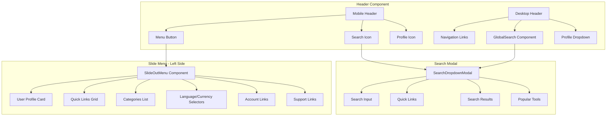

# Header & Slide Menu Improvement Plan

## Problem Analysis

### Current Issues

1. **Duplicate Slide Menu Implementations**
   - `Header.tsx` has an inline slide menu (lines 580-697)
   - `SlideOutMenu.tsx` exists as a separate component but is NOT used
   - This causes code duplication and maintenance issues

2. **Slide Menu Animation Problems**
   - Uses conditional rendering `{isMenuOpen && (...)}` which prevents exit animations
   - Should use CSS classes with transforms for smooth open/close transitions
   - Animation class `animate-slide-in-left` only handles enter animation

3. **Close Button Issues**
   - Close button may have event propagation conflicts
   - Z-index layering between backdrop and menu panel

4. **Search Functionality**
   - Mobile search is full-screen overlay
   - Desktop uses GlobalSearch dropdown
   - Need consistent search dropdown modal triggered by search icon

---

## Proposed Solution

### Architecture Diagram



---

## Implementation Plan

### Phase 1: Fix Slide Menu Animation & Close Button

#### 1.1 Update Slide Menu Rendering Approach
- Remove conditional rendering `{isMenuOpen && ...}`
- Use CSS transform classes for show/hide
- Always render the menu but translate it off-screen

**Before:**
```tsx
{isMenuOpen && (
  <div className="...">Menu Content</div>
)}
```

**After:**
```tsx
<div className={`
  fixed top-0 left-0 bottom-0 z-[70]
  transform transition-transform duration-300 ease-out
  ${isOpen ? 'translate-x-0' : '-translate-x-full'}
`}>
  Menu Content
</div>
```

#### 1.2 Fix Backdrop Z-Index & Click Handler
- Backdrop z-index: 60
- Menu panel z-index: 70
- Ensure close button has proper z-index within menu

#### 1.3 Add Smooth Exit Animation
- Keep component mounted during exit animation
- Use `onTransitionEnd` to unmount after animation completes
- Or use CSS visibility with opacity

---

### Phase 2: Improve Slide Menu Design

#### 2.1 Left Side Dynamic Features

```
┌─────────────────────────────────────┐
│  ┌─────┐ INDIA TOOLKIT      [X]     │
│  │ IT  │ India First               │
│  └─────┘                            │
├─────────────────────────────────────┤
│  ┌─────────────────────────────┐    │
│  │ 👤 Welcome!                 │    │
│  │    Sign in for personalized │    │
│  │    experience    [Sign In]  │    │
│  └─────────────────────────────┘    │
├─────────────────────────────────────┤
│  NAVIGATION                         │
│  ┌────┐ ┌────┐ ┌────┐ ┌────┐       │
│  │Home│ │Tools│ │Fav │ │Hist│       │
│  └────┘ └────┘ └────┘ └────┘       │
├─────────────────────────────────────┤
│  CATEGORIES                         │
│  🎨 Design Tools        >           │
│  💻 Developer Tools     >           │
│  📝 Text Tools          >           │
│  ...                                │
├─────────────────────────────────────┤
│  SETTINGS                           │
│  🌐 Language: English    >          │
│  💰 Currency: INR ₹      >          │
│  🌙 Dark Mode            [Toggle]   │
├─────────────────────────────────────┤
│  ACCOUNT                            │
│  👤 My Profile                      │
│  ⚙️ Settings                        │
│  🚪 Sign In                         │
├─────────────────────────────────────┤
│  SUPPORT                            │
│  📝 Blog  ❓ FAQ  📧 Contact        │
│  ℹ️ About                           │
├─────────────────────────────────────┤
│  Privacy | Terms | Sitemap          │
│  © 2024 India Toolkit               │
└─────────────────────────────────────┘
```

#### 2.2 Enhanced Features
- **User Profile Card**: Gradient background with avatar
- **Quick Links Grid**: 2x2 grid for common actions
- **Collapsible Categories**: Accordion style with icons
- **Settings Section**: Language, Currency, Dark Mode toggle
- **Recent Tools**: Show recently used tools
- **Popular Tools Badge**: Highlight trending tools

---

### Phase 3: Search Dropdown Modal

#### 3.1 Desktop Search Enhancement
- Keep GlobalSearch dropdown for desktop
- Add search icon click to toggle search focus
- Add keyboard shortcut (Cmd/Ctrl + K)

#### 3.2 Mobile Search Dropdown Modal
- Instead of full-screen overlay, use dropdown modal
- Slide down from header
- Show quick links and recent searches

```
┌─────────────────────────────────────┐
│  🔍 Search tools...            [X]  │
├─────────────────────────────────────┤
│  Quick Links                        │
│  ┌──────────┐ ┌──────────┐          │
│  │📋 All    │ │❤️ Saved  │          │
│  │  Tools   │ │  Tools   │          │
│  └──────────┘ └──────────┘          │
├─────────────────────────────────────┤
│  Popular Tools                      │
│  ⚡ AI Image Generator              │
│  ⚡ Code Formatter                  │
│  ⚡ Password Generator              │
├─────────────────────────────────────┤
│  Recent Searches                    │
│  🕐 image converter                 │
│  🕐 color palette                   │
└─────────────────────────────────────┘
```

---

### Phase 4: Code Consolidation

#### 4.1 Remove Duplicate Code
- Remove inline slide menu from Header.tsx (lines 580-697)
- Use SlideOutMenu.tsx component properly
- Pass necessary props: `isOpen`, `onClose`

#### 4.2 Create Unified SearchModal Component
- Combine mobile and desktop search logic
- Use responsive design for different layouts
- Share search results logic

---

## File Changes Required

### Files to Modify:
1. `components/Header.tsx`
   - Remove inline slide menu code
   - Import and use SlideOutMenu component
   - Add search dropdown modal trigger

2. `components/SlideOutMenu.tsx`
   - Fix animation approach (no conditional rendering)
   - Improve design and layout
   - Add dynamic features section
   - Fix close button functionality

3. `components/GlobalSearch.tsx`
   - Add mobile dropdown modal variant
   - Improve search UX

### New Files to Create:
1. `components/SearchDropdownModal.tsx` (optional - can be integrated into GlobalSearch)

### CSS Updates:
1. `app/globals.css`
   - Add slide menu transition classes
   - Add search dropdown animations

---

## Technical Implementation Details

### Slide Menu Animation CSS
```css
/* Slide menu transitions */
.slide-menu {
  transform: translateX(-100%);
  transition: transform 0.3s cubic-bezier(0.4, 0, 0.2, 1);
}

.slide-menu.open {
  transform: translateX(0);
}

.slide-menu-backdrop {
  opacity: 0;
  visibility: hidden;
  transition: opacity 0.3s ease, visibility 0.3s ease;
}

.slide-menu-backdrop.open {
  opacity: 1;
  visibility: visible;
}
```

### React Component Pattern
```tsx
// Always render, control with CSS
<div 
  className={`slide-menu ${isOpen ? 'open' : ''}`}
  aria-hidden={!isOpen}
>
  {/* Menu content */}
</div>
<div 
  className={`slide-menu-backdrop ${isOpen ? 'open' : ''}`}
  onClick={onClose}
/>
```

---

## Testing Checklist

- [ ] Slide menu opens smoothly from left
- [ ] Slide menu closes smoothly to left
- [ ] Close button works correctly
- [ ] Backdrop click closes menu
- [ ] Escape key closes menu
- [ ] Body scroll locked when menu open
- [ ] Search dropdown opens on icon click
- [ ] Search works correctly
- [ ] All links navigate correctly
- [ ] Responsive on all screen sizes
- [ ] No z-index conflicts
- [ ] Animations are smooth (60fps)

---

## Priority Order

1. **High Priority**: Fix slide menu animation and close button
2. **High Priority**: Remove duplicate code, use SlideOutMenu component
3. **Medium Priority**: Improve slide menu design
4. **Medium Priority**: Add search dropdown modal
5. **Low Priority**: Add additional dynamic features
