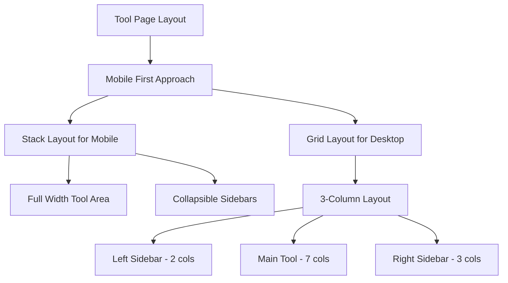
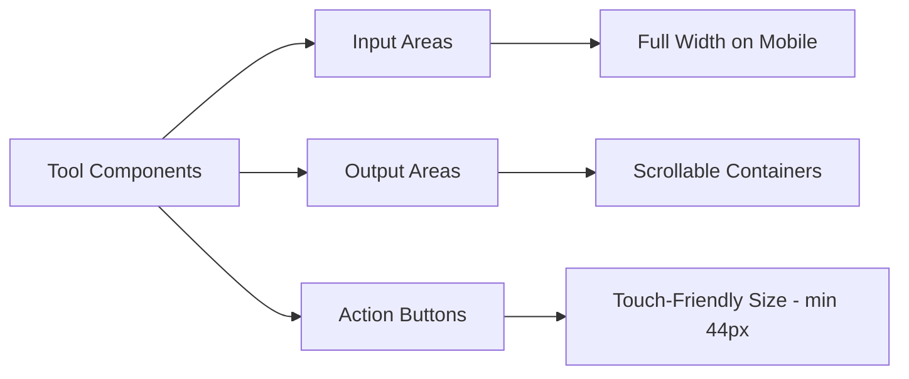

# Mobile Responsive Design Plan for Omnitools

## Executive Summary

This plan addresses mobile responsiveness issues in the Omnitools platform, ensuring all tools and components are fully visible and functional on mobile devices.

---

## Issues Identified

### 1. Main Tool Area Mobile Visibility Issues

**File:** [`app/tool/[slug]/page.tsx`](app/tool/[slug]/page.tsx)

| Issue | Line | Description |
|-------|------|-------------|
| Fixed height container | 248 | `min-h-137.5` causes overflow on mobile |
| 3-column grid layout | 198 | `lg:grid-cols-12` collapses but sidebars still take space |
| Navigation overflow | 139-164 | Top navigation bar overflows on small screens |
| Tool Switcher scaling | 153-155 | `scale-110` causes overflow on mobile |
| Padding issues | 137 | `px-4 md:px-10` may not be sufficient |

### 2. Header Mobile Navigation Issues

**File:** [`components/Header.tsx`](components/Header.tsx)

| Issue | Line | Description |
|-------|------|-------------|
| Search hidden on mobile | 243 | `hidden md:block` hides search completely |
| Desktop nav visible logic | 80 | Desktop nav items hidden but no mobile equivalent |
| Dropdown menus | 111-152 | Mega dropdowns not touch-friendly |

### 3. Tool Components Mobile Issues

**Files:** [`components/tools/*.tsx`](components/tools/)

| Issue | Affected Components |
|-------|---------------------|
| Fixed heights | JsonFormatter, PasswordGenerator, etc. |
| Grid layouts | PasswordGenerator, ColorPaletteGenerator |
| Small touch targets | All tools with buttons |
| Text overflow | Tools with long output |

### 4. CSS Framework Issues

**Files:** [`app/globals.css`](app/globals.css), [`app/tools-platform.css`](app/tools-platform.css)

| Issue | Description |
|-------|-------------|
| Missing mobile utilities | No touch-specific styles |
| Inconsistent breakpoints | Mixed sm/md/lg usage |
| Fixed dimensions | Hard-coded pixel values |

---

## Solution Architecture

### Phase 1: Core Layout Fixes



### Phase 2: Component Responsive Updates



---

## Detailed Implementation Plan

### Task 1: Fix Main Tool Area Mobile Visibility

**File:** `app/tool/[slug]/page.tsx`

**Changes Required:**

1. **Navigation Bar - Lines 139-164**
   - Make navigation stack vertically on mobile
   - Hide ToolSwitcher on mobile or make it collapsible
   - Reduce padding and margins

2. **Main Grid Layout - Line 198**
   ```tsx
   // Current
   <div className="grid grid-cols-1 lg:grid-cols-12 gap-8">
   
   // Proposed
   <div className="flex flex-col lg:grid lg:grid-cols-12 gap-4 lg:gap-8">
   ```

3. **Tool Container - Lines 242-253**
   - Remove fixed min-height
   - Add responsive padding
   - Make overflow handling better

4. **Sidebars - Lines 200-239 and 282-338**
   - Hide on mobile by default
   - Add expand/collapse functionality
   - Show below main tool area when expanded

### Task 2: Update CSS Framework

**File:** `app/tools-platform.css`

Add mobile-first responsive utilities:

```css
/* Mobile First Base Styles */
.tool-container {
  @apply w-full px-4 py-6;
}

/* Tablet and up */
@media (min-width: 768px) {
  .tool-container {
    @apply px-6 py-8;
  }
}

/* Desktop */
@media (min-width: 1024px) {
  .tool-container {
    @apply px-10 py-10;
  }
}

/* Touch-friendly buttons */
.touch-target {
  min-height: 44px;
  min-width: 44px;
}

/* Scrollable containers for mobile */
.mobile-scroll {
  -webkit-overflow-scrolling: touch;
  overflow-x: auto;
}
```

**File:** `app/globals.css`

Add mobile utilities:

```css
/* Mobile responsive text */
@media (max-width: 640px) {
  h1 { @apply text-2xl; }
  h2 { @apply text-xl; }
  h3 { @apply text-lg; }
}

/* Touch device optimizations */
@media (hover: none) {
  .hover-lift:hover {
    transform: none;
  }
}

/* Safe area insets for notched devices */
.safe-area-inset {
  padding-left: env(safe-area-inset-left);
  padding-right: env(safe-area-inset-right);
  padding-bottom: env(safe-area-inset-bottom);
}
```

### Task 3: Header Mobile Navigation

**File:** `components/Header.tsx`

1. Add mobile search in the mobile menu
2. Make dropdown menus touch-friendly
3. Add bottom navigation bar for mobile

### Task 4: Tool Components Audit

**Priority Components to Fix:**

| Component | File | Issues |
|-----------|------|--------|
| JsonFormatter | JsonFormatter.tsx | Fixed 500px height |
| PasswordGenerator | PasswordGenerator.tsx | Grid layout overflow |
| Image Tools | ImageCompressor.tsx etc. | Fixed dimensions |
| Calculators | Various | Input field sizing |
| Generators | Various | Output display overflow |

**Standard Mobile Pattern for Tools:**

```tsx
// Standard mobile-responsive tool layout
<div className="space-y-4 md:space-y-6 p-4 md:p-6">
  {/* Action buttons - stack on mobile */}
  <div className="flex flex-col sm:flex-row gap-2">
    <button className="brutal-btn w-full sm:w-auto">Action</button>
  </div>
  
  {/* Input area - full width on mobile */}
  <div className="w-full">
    <textarea className="w-full h-48 md:h-96 brutal-textarea" />
  </div>
  
  {/* Output area - scrollable on mobile */}
  <div className="w-full overflow-x-auto">
    {/* Output content */}
  </div>
</div>
```

---

## Tool Functionality Verification

### Tools Requiring Testing

1. **Text Tools**
   - JSON Formatter - Format, minify, validate
   - Case Converter - All case transformations
   - Word Counter - Count functionality

2. **Generator Tools**
   - Password Generator - Generate, copy, strength indicator
   - QR Generator - Generate, download
   - UUID Generator - Generate, copy

3. **Calculator Tools**
   - BMI Calculator - Input, calculate, display
   - EMI Calculator - All fields functional
   - Currency Converter - API integration

4. **Image Tools**
   - Image Compressor - Upload, compress, download
   - Image Resizer - Resize functionality
   - Image Format Converter - Format conversion

5. **AI Tools**
   - AI Text Generator - API integration
   - AI Summarizer - Text processing
   - AI Grammar Checker - Grammar analysis

---

## Implementation Order

1. **Phase 1: Critical Layout Fixes**
   - Fix tool page main area visibility
   - Update responsive grid layout
   - Fix navigation overflow

2. **Phase 2: CSS Framework Updates**
   - Add mobile utilities
   - Update existing styles
   - Add touch optimizations

3. **Phase 3: Component Updates**
   - Update high-priority tools
   - Standardize mobile patterns
   - Add touch-friendly interactions

4. **Phase 4: Testing & Verification**
   - Test all tools on mobile
   - Verify functionality
   - Cross-browser testing

---

## Files to Modify

### Layout Files
- `app/tool/[slug]/page.tsx` - Main tool page layout
- `app/page.tsx` - Homepage responsive fixes
- `app/layout.tsx` - Root layout adjustments

### CSS Files
- `app/globals.css` - Global responsive utilities
- `app/tools-platform.css` - Platform-specific styles

### Component Files
- `components/Header.tsx` - Mobile navigation
- `components/ToolRenderer.tsx` - Tool rendering wrapper
- `components/tools/*.tsx` - Individual tool components

---

## Success Criteria

1. All tools visible and usable on screens 320px and wider
2. Touch targets minimum 44px for all interactive elements
3. No horizontal scroll on any page
4. All tool functionality working correctly
5. Fast load times on mobile networks
6. Accessible on both iOS and Android devices

---

## Estimated Scope

| Category | Files to Modify | Complexity |
|----------|-----------------|------------|
| Layout | 3 | Medium |
| CSS | 2 | Low |
| Header | 1 | Medium |
| Tool Components | 150+ | High |
| Testing | All | Medium |

---

## Next Steps

1. Switch to Code mode to implement the changes
2. Start with Phase 1 critical layout fixes
3. Progress through each phase systematically
4. Test each component after modification
