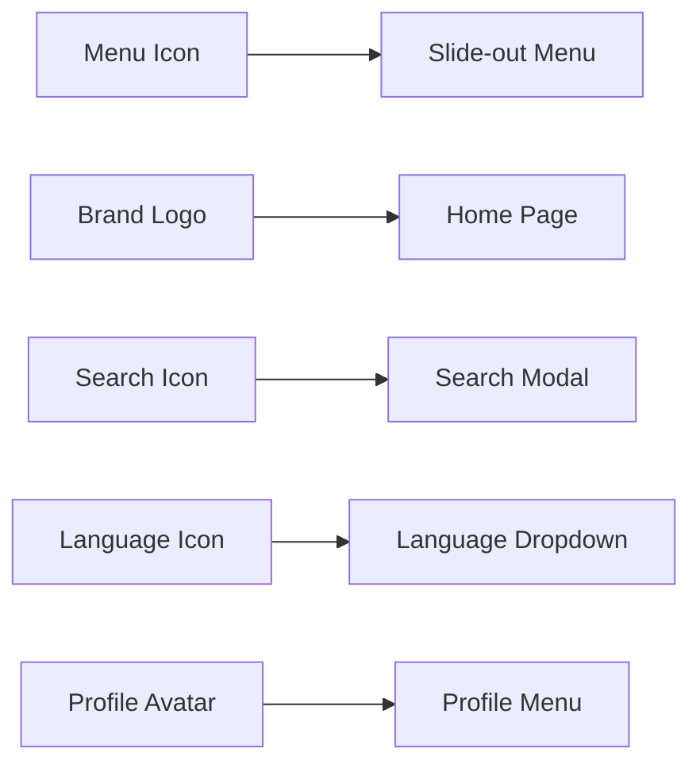
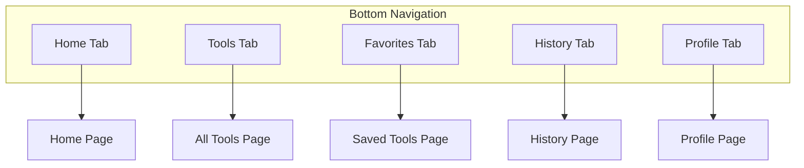
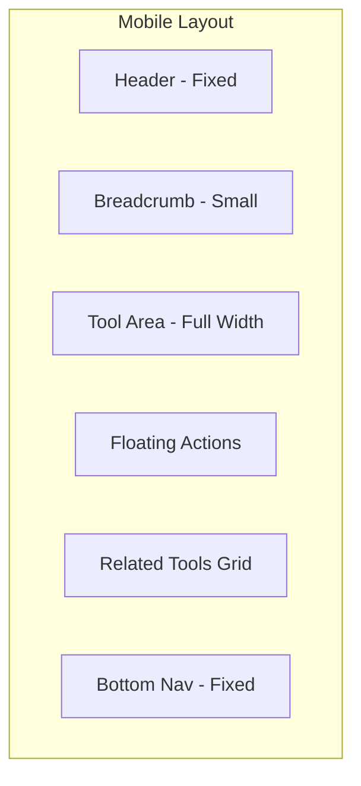

# Mobile Responsive Enhancement Plan

## Overview
This plan outlines the enhancements needed to make the tool page and header fully mobile-responsive with advanced features.

---

## 1. Mobile Header Redesign

### Current State
- Header has basic mobile menu but needs improvement
- No language selector
- No currency selector
- Profile/avatar needs better mobile integration

### Proposed Changes

#### Mobile Header Layout (Left to Right)
```
┌────────────────────────────────────────────────────────────┐
│ [≡] [IT Logo] India Toolkit        [🔍] [🌐] [👤]        │
└────────────────────────────────────────────────────────────┘
```

#### Components:
1. **Left Side:**
   - Menu icon (hamburger) - opens slide-out menu from left
   - Brand logo with "IT" initials
   - "India Toolkit" text (hidden on very small screens)

2. **Right Side:**
   - Search icon (opens search modal)
   - Language selector (globe icon with dropdown)
   - Profile avatar (circular, with dropdown)

#### Slide-out Menu (from left):
- Full-height drawer
- Smooth animation from left
- Contains:
  - User profile section at top
  - Navigation links
  - Categories list
  - Settings
  - Language & Currency options

---

## 2. Mobile Bottom Navigation (5 Tabs)

### Tab Items:
```
┌─────────────────────────────────────────────────────────────┐
│   🏠      │   🔧      │   ⭐      │   📜      │   👤      │
│  Home     │  Tools    │ Favorites │ History  │ Profile   │
└─────────────────────────────────────────────────────────────┘
```

### Features:
- Fixed at bottom on mobile only
- Safe area inset support for notched devices
- Active state highlighting
- Haptic feedback on tap (where supported)
- Badge support for notifications

---

## 3. Tool Page Navigation Enhancement

### Current Navigation:
```tsx
<nav className="flex items-center gap-2...">
  <Link href="/">Home</Link>
  <ChevronRight />
  <Link href={`/category/${tool.category}`}>{category?.name}</Link>
</nav>
```

### Proposed Dynamic Navigation:
- Smaller, text-only on mobile
- Dynamic breadcrumb based on tool location
- Truncate long category names
- Add tool name at end (optional)

### Mobile View:
```
Home > Category > Tool
```

### Desktop View:
```
🏠 Home > 📁 Category Name > 🔧 Tool Name
```

---

## 4. Tool Actions Enhancement

### Current Actions:
- Tool switcher dropdown
- Basic tool actions

### Proposed Actions Bar:
```
┌─────────────────────────────────────────────────────────────┐
│ [🔄 Switch Tool]  │ [❤️] [📤] [💱] [⚙️]                   │
└─────────────────────────────────────────────────────────────┘
```

#### Actions:
1. **Favorite (❤️)** - Save tool to favorites
2. **Share (📤)** - Share tool link (copy, social media)
3. **Currency (💱)** - Change currency (for relevant tools)
4. **Settings (⚙️)** - Tool-specific settings

### Currency Selector:
- Show only for tools that need currency conversion
- Dropdown with popular currencies
- Remember user preference
- Auto-detect based on location

---

## 5. Full-Width Tool Area Enhancement

### Responsive Grid Design:

#### Mobile (320px - 640px):
- Single column layout
- Full-width tool container
- Collapsible sections
- Floating action buttons

#### Tablet (640px - 1024px):
- Two column layout where appropriate
- Side panel for settings
- Expanded tool area

#### Desktop (1024px+):
- Multi-column layout
- Full feature display
- Side-by-side panels

### Dynamic Tool Area Features:
1. **Collapsible Panels** - Accordion-style sections
2. **Floating Quick Actions** - FAB for common actions
3. **Progressive Disclosure** - Show more options as needed
4. **Contextual Help** - Tooltips and guides
5. **Input/Output Split View** - Side by side on larger screens

---

## 6. Implementation Files

### New Components to Create:
1. `components/MobileHeader.tsx` - New mobile-first header
2. `components/MobileBottomNav.tsx` - Bottom navigation tabs
3. `components/SlideOutMenu.tsx` - Left slide-out drawer
4. `components/LanguageSelector.tsx` - Language dropdown
5. `components/CurrencySelector.tsx` - Currency dropdown
6. `components/ToolActionsBar.tsx` - Enhanced tool actions
7. `components/DynamicBreadcrumb.tsx` - Dynamic navigation

### Files to Modify:
1. `components/Header.tsx` - Integrate mobile components
2. `app/tool/[slug]/page.tsx` - Use new components
3. `app/globals.css` - Add mobile-specific styles
4. `app/layout.tsx` - Add bottom nav wrapper

---

## 7. Technical Considerations

### Performance:
- Lazy load mobile components
- Use CSS transforms for animations
- Implement virtualization for long lists

### Accessibility:
- ARIA labels for all interactive elements
- Keyboard navigation support
- Screen reader announcements
- Focus management for modals

### State Management:
- Use React context for:
  - Language preference
  - Currency preference
  - User session
  - Favorites list

### Storage:
- localStorage for preferences
- Cookie for session
- IndexedDB for offline data

---

## 8. Visual Design

### Color Scheme:
- Primary: Green (#10B981)
- Secondary: Blue (#3B82F6)
- Accent: Amber (#F59E0B)
- Background: White/Slate gradient

### Typography:
- Headings: Bold, uppercase, tight tracking
- Body: Semi-bold, normal tracking
- Small: Medium weight, wide tracking

### Spacing:
- Mobile: 8px base unit
- Tablet: 12px base unit
- Desktop: 16px base unit

### Animations:
- Slide: 300ms ease-out
- Fade: 200ms ease-in-out
- Scale: 150ms cubic-bezier

---

## 9. Mermaid Diagrams

### Mobile Header Flow:


### Bottom Navigation Flow:


### Tool Page Layout:


---

## 10. Implementation Order

1. **Phase 1: Core Components**
   - MobileBottomNav component
   - SlideOutMenu component
   - LanguageSelector component
   - CurrencySelector component

2. **Phase 2: Header Integration**
   - Update Header.tsx with new mobile layout
   - Add slide-out menu functionality
   - Integrate language and currency selectors

3. **Phase 3: Tool Page Enhancement**
   - DynamicBreadcrumb component
   - ToolActionsBar component
   - Responsive tool area layout

4. **Phase 4: Polish & Testing**
   - Animation refinements
   - Accessibility testing
   - Cross-browser testing
   - Performance optimization

---

## Next Steps

Switch to Code mode to implement these components:
1. Start with MobileBottomNav.tsx
2. Create SlideOutMenu.tsx
3. Update Header.tsx
4. Enhance tool page with new components
