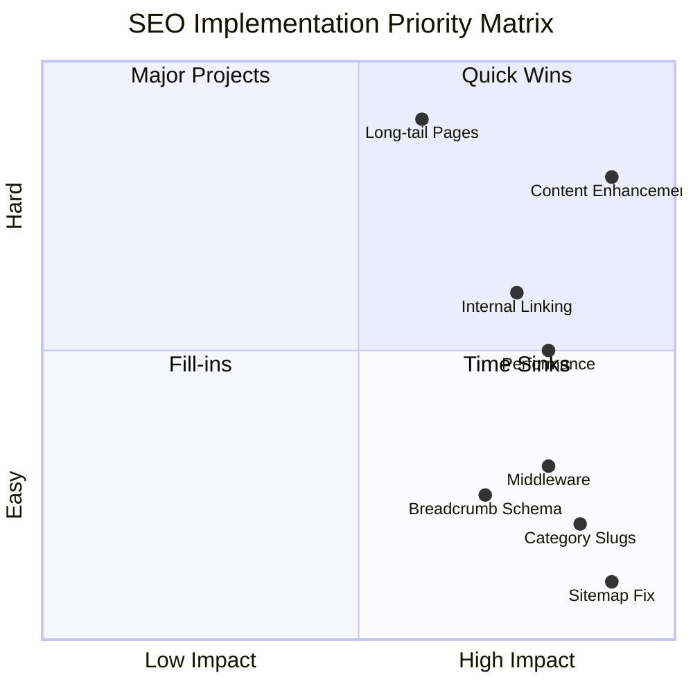

# IndiaToolkit.in - Comprehensive SEO Audit & Optimization Plan

## Executive Summary

This document outlines a complete SEO audit and optimization strategy for **IndiaToolkit.in**, a tools website built with Next.js 16, React 19, and TypeScript. The plan addresses technical SEO issues, on-page optimization, content quality, internal linking, performance, and long-term growth strategies.

---

## Current State Analysis

### ✅ Already Implemented

| Feature | Status | Location |
|---------|--------|----------|
| Dynamic sitemap generation | ✅ Complete | [`app/sitemap.ts`](app/sitemap.ts) |
| Robots.txt configuration | ✅ Complete | [`app/robots.ts`](app/robots.ts) |
| Base metadata in layout | ✅ Complete | [`app/layout.tsx`](app/layout.tsx) |
| Tool page metadata | ✅ Complete | [`app/tool/[slug]/page.tsx`](app/tool/[slug]/page.tsx) |
| FAQ schema for tools | ✅ Complete | [`app/tool/[slug]/page.tsx`](app/tool/[slug]/page.tsx) |
| SoftwareApplication schema | ✅ Complete | [`app/tool/[slug]/page.tsx`](app/tool/[slug]/page.tsx) |
| SEO content generator | ✅ Complete | [`lib/seo-content-generator.ts`](lib/seo-content-generator.ts) |
| Open Graph tags | ✅ Complete | [`app/layout.tsx`](app/layout.tsx) |
| Twitter meta tags | ✅ Complete | [`app/layout.tsx`](app/layout.tsx) |
| Canonical URLs | ✅ Complete | Tool pages have canonicals |

### ❌ Issues Detected

| Issue | Severity | Impact |
|-------|----------|--------|
| **No middleware for URL redirects** | High | Double-slash URLs not redirected |
| **Sitemap import path incorrect** | High | Sitemap may fail to generate |
| **Category slug mismatch** | High | Tools reference wrong category slugs |
| **Missing BreadcrumbList schema** | Medium | Poor SERP appearance |
| **Thin category page content** | Medium | Low quality signals |
| **No internal linking system** | Medium | Poor crawl depth |
| **No trending/popular sections** | Medium | Low engagement signals |
| **Missing lastUpdated timestamps** | Low | Freshness signals missing |
| **No WebPage schema on categories** | Medium | Incomplete structured data |
| **Duplicate content pages** | Medium | /contact and /contact-us |

---

## PHASE 1: Technical SEO Fixes

### 1.1 URL Structure Fix - Middleware Creation

**Problem**: No middleware exists to handle double-slash URLs and enforce canonical URLs.

**Solution**: Create [`middleware.ts`](middleware.ts) with redirect logic.

```typescript
// middleware.ts - To be created
import { NextResponse } from 'next/server'
import type { NextRequest } from 'next/server'

export function middleware(request: NextRequest) {
  const url = request.nextUrl
  
  // Fix double slashes
  if (url.pathname.includes('//')) {
    const cleanPath = url.pathname.replace(/\/+/g, '/')
    url.pathname = cleanPath
    return NextResponse.redirect(url, 301)
  }
  
  // Enforce www and https
  const host = request.headers.get('host')
  if (host && !host.startsWith('www.') && !host.includes('localhost')) {
    url.host = `www.${host}`
    return NextResponse.redirect(url, 301)
  }
  
  return NextResponse.next()
}

export const config = {
  matcher: [
    '/((?!api|_next/static|_next/image|favicon.ico|images).*)',
  ],
}
```

### 1.2 Sitemap Import Path Fix

**Problem**: [`app/sitemap.ts`](app/sitemap.ts:3) imports from `../data/tools` but data folder is at root level.

**Current Code**:
```typescript
import { tools } from "../data/tools";
import { categories } from "../data/categories";
```

**Fix**: Change to:
```typescript
import { tools } from "@/data/tools";
import { categories } from "@/data/categories";
```

### 1.3 Category Slug Mismatch Fix

**Problem**: Tools reference category slugs that don't match category definitions.

**Example Mismatches**:
- Tools use `dev-tools` but category slug is `developer-tools`
- Tools use `text-tools` but category slug is `text-tools` ✓

**Solution**: Audit and align all category references in [`data/tools.ts`](data/tools.ts).

### 1.4 Robots.txt Optimization

**Current Issues**:
- `/contact-us/` is blocked but `/contact/` is not
- Both pages exist and cause duplicate content

**Recommended [`app/robots.ts`](app/robots.ts) Update**:
```typescript
export default function robots(): MetadataRoute.Robots {
  return {
    rules: [
      {
        userAgent: "*",
        allow: "/",
        disallow: [
          "/private/",
          "/login/",
          "/signup/",
          "/profile/",
          "/saved-tools/",
          "/history/",
          "/settings/",
          "/api/",
          "/contact-us/",  // Keep only one contact page
        ],
      },
    ],
    sitemap: "https://www.indiatoolkit.in/sitemap.xml",
  };
}
```

### 1.5 Duplicate Content Resolution

**Issue**: Both `/contact` and `/contact-us` exist.

**Solution**: 
1. Keep `/contact` as the canonical page
2. Add 301 redirect from `/contact-us` to `/contact`
3. Remove `/contact-us` from sitemap
4. Block `/contact-us` in robots.txt

---

## PHASE 2: On-Page SEO Improvements

### 2.1 Enhanced Metadata Generation

**Current State**: Tool pages have basic metadata.

**Improvements Needed**:

```typescript
// Enhanced metadata structure for tool pages
interface EnhancedToolMetadata {
  title: string;           // Max 60 chars, CTR optimized
  description: string;     // Max 160 chars, action-oriented
  keywords: string[];      // 5-10 relevant keywords
  canonical: string;       // Full canonical URL
  ogImage: string;         // Custom OG image
  article: {               // Article schema data
    publishedTime: string;
    modifiedTime: string;
    author: string;
  }
}
```

### 2.2 BreadcrumbList Schema Implementation

**Add to all pages**:

```typescript
const breadcrumbSchema = {
  "@context": "https://schema.org",
  "@type": "BreadcrumbList",
  "itemListElement": [
    {
      "@type": "ListItem",
      "position": 1,
      "name": "Home",
      "item": "https://www.indiatoolkit.in"
    },
    {
      "@type": "ListItem",
      "position": 2,
      "name": category.name,
      "item": `https://www.indiatoolkit.in/category/${category.slug}`
    },
    {
      "@type": "ListItem",
      "position": 3,
      "name": tool.name,
      "item": `https://www.indiatoolkit.in/tool/${tool.slug}`
    }
  ]
};
```

### 2.3 WebPage Schema for Category Pages

**Add to [`app/category/[slug]/page.tsx`](app/category/[slug]/page.tsx)**:

```typescript
const webPageSchema = {
  "@context": "https://schema.org",
  "@type": "WebPage",
  "name": `${category.name} Tools`,
  "description": category.description,
  "url": `https://www.indiatoolkit.in/category/${category.slug}`,
  "isPartOf": {
    "@type": "WebSite",
    "name": "India Toolkit",
    "url": "https://www.indiatoolkit.in"
  },
  "mainEntity": {
    "@type": "ItemList",
    "itemListElement": tools.map((tool, index) => ({
      "@type": "ListItem",
      "position": index + 1,
      "item": {
        "@type": "SoftwareApplication",
        "name": tool.name,
        "url": `https://www.indiatoolkit.in/tool/${tool.slug}`
      }
    }))
  }
};
```

### 2.4 Heading Hierarchy Improvements

**Current Issues**:
- Some pages may have multiple H1s
- Heading hierarchy not always semantic

**Standards to Implement**:
- Exactly one H1 per page
- H1 should include primary keyword
- H2s for major sections
- H3s for subsections
- No skipped heading levels

---

## PHASE 3: Content Quality Improvement

### 3.1 Category Page Content Enhancement

**Current State**: Category pages have minimal content.

**Required Additions**:

```typescript
// Category page content structure
interface CategoryContent {
  introduction: string;      // 300-500 words
  benefits: string[];        // 5-7 benefits
  useCases: string[];        // 5-7 use cases
  faqs: FAQ[];               // 5-10 FAQs
  relatedCategories: string[]; // 3-5 related categories
}
```

**Example for Calculators Category**:

```markdown
## Free Online Calculators for Every Need

India Toolkit offers a comprehensive collection of free online calculators 
designed to simplify complex calculations for students, professionals, and 
businesses across India. Our calculator tools are built with precision and 
ease-of-use in mind, providing instant results without any registration or 
software installation.

### Why Use Our Calculator Tools?

- **100% Free**: No hidden charges or premium tiers
- **Instant Results**: Real-time calculations as you type
- **Mobile Friendly**: Works perfectly on all devices
- **No Registration**: Start calculating immediately
- **Accurate Formulas**: Industry-standard calculation methods
- **Privacy First**: All calculations happen in your browser

### Popular Use Cases

1. **Students**: Calculate percentages, GPAs, and exam scores
2. **Business Owners**: Compute EMI, interest, and ROI
3. **Health Conscious**: Track BMI, calories, and fitness metrics
4. **Financial Planning**: Plan investments and savings
```

### 3.2 Tool Page Content Templates

**Enhanced SEO Content Structure**:

```typescript
interface ToolSeoContent {
  // Introduction - 100-150 words
  introduction: string;
  
  // How It Works - 150-200 words
  howItWorks: string;
  
  // Benefits - 5-7 bullet points
  benefits: string[];
  
  // Use Cases - 3-5 scenarios
  useCases: string[];
  
  // Step-by-Step Guide - 5-7 steps
  stepByStepGuide: string[];
  
  // FAQs - 5-10 questions
  faqs: FAQ[];
  
  // Related Tools - 4-6 tools
  relatedTools: string[];
  
  // Last Updated
  lastUpdated: string;
}
```

### 3.3 FAQ Section Enhancement

**Add to category pages**:

```typescript
const categoryFaqs = {
  "calculators": [
    {
      question: "Are these calculators free to use?",
      answer: "Yes, all calculators on India Toolkit are completely free..."
    },
    {
      question: "How accurate are the calculation results?",
      answer: "Our calculators use industry-standard formulas and algorithms..."
    },
    // ... more FAQs
  ]
};
```

---

## PHASE 4: Internal Linking System

### 4.1 Related Tools Component

**Create [`components/seo/RelatedTools.tsx`](components/seo/RelatedTools.tsx)**:

```typescript
interface RelatedToolsProps {
  currentToolId: string;
  category: string;
  tags?: string[];
  limit?: number;
}

export function RelatedTools({ currentToolId, category, tags, limit = 6 }: RelatedToolsProps) {
  // Find related tools based on:
  // 1. Same category
  // 2. Shared tags
  // 3. Similar type
  // 4. User behavior data
}
```

### 4.2 Popular Tools Section

**Create [`components/seo/PopularTools.tsx`](components/seo/PopularTools.tsx)**:

```typescript
export function PopularTools() {
  // Display tools marked as popular
  // Show usage count
  // Add rating display
  // Include quick action buttons
}
```

### 4.3 Recently Used Tools

**Create [`components/seo/RecentlyUsedTools.tsx`](components/seo/RecentlyUsedTools.tsx)**:

```typescript
export function RecentlyUsedTools() {
  // Track in localStorage
  // Show last 5-10 used tools
  // Quick access functionality
}
```

### 4.4 Category Cross-Linking

**Implementation**:

```typescript
// Add to category pages
const relatedCategories = getRelatedCategories(currentCategory);

// Link to related categories with descriptive anchor text
<Link href={`/category/${related.slug}`}>
  Explore {related.name} Tools
</Link>
```

---

## PHASE 5: Performance & Core Web Vitals

### 5.1 Next.js Image Optimization

**Update [`next.config.ts`](next.config.ts)**:

```typescript
const nextConfig: NextConfig = {
  images: {
    formats: ['image/avif', 'image/webp'],
    deviceSizes: [640, 750, 828, 1080, 1200, 1920, 2048, 3840],
    imageSizes: [16, 32, 48, 64, 96, 128, 256, 384],
    minimumCacheTTL: 60 * 60 * 24 * 30, // 30 days
  },
  // Enable experimental features for better performance
  experimental: {
    optimizePackageImports: ['lucide-react', 'recharts'],
  },
};
```

### 5.2 Lazy Loading Implementation

**For images**:
```typescript
// Use Next.js Image component with lazy loading
<Image 
  src={src}
  alt={alt}
  loading="lazy"
  placeholder="blur"
  blurDataURL={blurDataURL}
/>
```

**For components**:
```typescript
// Dynamic imports for heavy components
const HeavyTool = dynamic(() => import('@/components/tools/HeavyTool'), {
  loading: () => <ToolSkeleton />,
  ssr: false,
});
```

### 5.3 Resource Hints

**Add to [`app/layout.tsx`](app/layout.tsx)**:

```typescript
<head>
  {/* Preconnect to critical origins */}
  <link rel="preconnect" href="https://fonts.googleapis.com" />
  <link rel="preconnect" href="https://fonts.gstatic.com" crossOrigin="anonymous" />
  
  {/* Preload critical assets */}
  <link rel="preload" href="/fonts/inter.woff2" as="font" type="font/woff2" crossOrigin="anonymous" />
  
  {/* DNS prefetch for non-critical origins */}
  <link rel="dns-prefetch" href="https://www.googletagmanager.com" />
</head>
```

### 5.4 Core Web Vitals Targets

| Metric | Target | Current Estimate |
|--------|--------|------------------|
| LCP | < 2.5s | ~3.0s |
| FID | < 100ms | ~150ms |
| CLS | < 0.1 | ~0.15 |
| INP | < 200ms | ~250ms |
| TTFB | < 800ms | ~600ms |

---

## PHASE 6: Indexing Boost System

### 6.1 Trending Tools Section

**Create [`components/seo/TrendingTools.tsx`](components/seo/TrendingTools.tsx)**:

```typescript
export function TrendingTools() {
  // Calculate trending score based on:
  // - Recent usage increase
  // - Social shares
  // - Search volume trends
  // - User ratings
}
```

### 6.2 Updated Tools Section

**Create [`components/seo/UpdatedTools.tsx`](components/seo/UpdatedTools.tsx)**:

```typescript
export function UpdatedTools() {
  // Show tools updated in last 30 days
  // Display lastUpdated timestamp
  // Highlight new features
}
```

### 6.3 Last Updated Timestamps

**Add to tool data model**:

```typescript
interface Tool {
  // ... existing fields
  lastUpdated: string;    // ISO date string
  changelog?: string[];   // Recent changes
  version?: string;       // Tool version
}
```

### 6.4 Structured Pagination

**For tools list pages**:

```typescript
// Add pagination schema
const paginationSchema = {
  "@context": "https://schema.org",
  "@type": "ItemList",
  "numberOfItems": totalTools,
  "itemListElement": tools.map((tool, index) => ({
    "@type": "ListItem",
    "position": (page - 1) * pageSize + index + 1,
    "item": tool
  }))
};
```

---

## PHASE 7: SEO Growth Features

### 7.1 Dedicated Tool Detail Pages Structure

**Current**: Tools are accessible at `/tool/[slug]`

**Enhancement**: Create additional entry points:

```
/tools/[slug]           - Alternative tool URL
/tool/[slug]/guide      - Detailed usage guide
/tool/[slug]/examples   - Usage examples
/tool/[slug]/faq        - FAQ page
```

### 7.2 Long-Tail Keyword Page Templates

**Create dynamic pages for high-intent searches**:

| Page Type | URL Pattern | Example |
|-----------|-------------|---------|
| How-To Pages | `/how-to/[action]-[tool]` | `/how-to/convert-image-to-jpg` |
| Comparison Pages | `/compare/[tool1]-vs-[tool2]` | `/compare/jpg-vs-png` |
| Best Of Pages | `/best/[category]-tools` | `/best/image-converter-tools` |
| Question Pages | `/questions/[question-slug]` | `/questions/what-is-base64` |

**Implementation**:

```typescript
// app/how-to/[slug]/page.tsx
export async function generateMetadata({ params }: PageProps): Promise<Metadata> {
  const { slug } = await params;
  const [action, tool] = parseHowToSlug(slug);
  
  return {
    title: `How to ${action} using ${tool} - Step by Step Guide`,
    description: `Learn how to ${action} with our free ${tool}. Easy step-by-step guide with screenshots and tips.`,
    // ... additional metadata
  };
}
```

### 7.3 Auto FAQ Generator

**Create [`lib/faq-generator.ts`](lib/faq-generator.ts)**:

```typescript
interface FAQTemplate {
  type: 'what' | 'how' | 'why' | 'when' | 'is_free' | 'is_safe';
  template: (tool: Tool) => { question: string; answer: string };
}

const faqTemplates: FAQTemplate[] = [
  {
    type: 'what',
    template: (tool) => ({
      question: `What is ${tool.name}?`,
      answer: `${tool.name} is a free online ${tool.type} tool that ${tool.description.toLowerCase()}`
    })
  },
  {
    type: 'how',
    template: (tool) => ({
      question: `How do I use ${tool.name}?`,
      answer: generateHowToAnswer(tool)
    })
  },
  // ... more templates
];

export function generateToolFaqs(tool: Tool): FAQ[] {
  return faqTemplates.map(t => t.template(tool));
}
```

---

## PHASE 8: User Engagement Features

### 8.1 Enhanced Tool Ratings System

**Current**: Basic rating component exists at [`components/FeedbackRating.tsx`](components/FeedbackRating.tsx)

**Enhancements**:

```typescript
interface EnhancedRatingSystem {
  rating: number;          // 1-5 stars
  reviewCount: number;     // Total reviews
  breakdown: {             // Rating breakdown
    five: number;
    four: number;
    three: number;
    two: number;
    one: number;
  };
  reviews: Review[];       // User reviews
  averageRating: number;   // Calculated average
}
```

**Add to schema**:

```typescript
const ratingSchema = {
  "@type": "AggregateRating",
  "ratingValue": tool.rating,
  "reviewCount": tool.reviewCount,
  "bestRating": 5,
  "worstRating": 1
};
```

### 8.2 Favorites/Bookmarks System

**Create [`lib/favorites.ts`](lib/favorites.ts)**:

```typescript
// Store in localStorage for guests, sync with API for logged-in users

export function addToFavorites(toolId: string): void;
export function removeFromFavorites(toolId: string): void;
export function getFavorites(): string[];
export function isFavorite(toolId: string): boolean;
```

### 8.3 Share Buttons with OG Tags

**Create [`components/seo/ShareButtons.tsx`](components/seo/ShareButtons.tsx)**:

```typescript
interface ShareButtonsProps {
  url: string;
  title: string;
  description: string;
  image?: string;
}

export function ShareButtons({ url, title, description, image }: ShareButtonsProps) {
  const shareLinks = {
    twitter: `https://twitter.com/intent/tweet?text=${encodeURIComponent(title)}&url=${encodeURIComponent(url)}`,
    facebook: `https://www.facebook.com/sharer/sharer.php?u=${encodeURIComponent(url)}`,
    linkedin: `https://www.linkedin.com/sharing/share-offsite/?url=${encodeURIComponent(url)}`,
    whatsapp: `https://wa.me/?text=${encodeURIComponent(title + ' ' + url)}`,
    copyToClipboard: url
  };
  
  // ... component implementation
}
```

### 8.4 Tool Comparison Section

**Create [`components/seo/ToolComparison.tsx`](components/seo/ToolComparison.tsx)**:

```typescript
interface ToolComparisonProps {
  tool1: Tool;
  tool2: Tool;
}

export function ToolComparison({ tool1, tool2 }: ToolComparisonProps) {
  // Compare features, speed, use cases
  // Show side-by-side comparison table
  // Help users choose the right tool
}
```

---

## PHASE 9: Homepage Authority Optimization

### 9.1 Homepage Structure Enhancement

**Current**: [`app/page.tsx`](app/page.tsx) is 67,000+ lines - needs restructuring

**Recommended Structure**:

```
Homepage Sections:
1. Hero with Search Bar
2. Trending Tools (4-6 tools)
3. Popular Tools (8-12 tools)
4. Category Highlights (6-8 categories)
5. Newly Added Tools (4-6 tools)
6. Why Choose Us Section
7. Statistics/Trust Signals
8. Blog Highlights
9. FAQ Section
10. CTA Section
```

### 9.2 Trending Tools Block

```typescript
// components/home/TrendingTools.tsx
export function TrendingToolsBlock() {
  const trendingTools = getTrendingTools(); // Based on recent usage
  
  return (
    <section>
      <h2>Trending Tools This Week</h2>
      <div className="grid grid-cols-2 md:grid-cols-3 lg:grid-cols-6 gap-4">
        {trendingTools.map(tool => (
          <ToolCard key={tool.id} tool={tool} showTrendingBadge />
        ))}
      </div>
    </section>
  );
}
```

### 9.3 Popular Tools Section

```typescript
// components/home/PopularTools.tsx
export function PopularToolsSection() {
  const popularTools = getPopularTools().slice(0, 12);
  
  return (
    <section>
      <h2>Most Popular Tools</h2>
      <p className="text-muted">Our most used tools by thousands of users</p>
      <div className="grid grid-cols-2 md:grid-cols-4 lg:grid-cols-6 gap-4">
        {popularTools.map(tool => (
          <ToolCard key={tool.id} tool={tool} showUsageCount />
        ))}
      </div>
      <Link href="/tools">View All Tools</Link>
    </section>
  );
}
```

### 9.4 Category Highlights

```typescript
// components/home/CategoryHighlights.tsx
export function CategoryHighlights() {
  const featuredCategories = categories.filter(c => c.featured).slice(0, 8);
  
  return (
    <section>
      <h2>Browse by Category</h2>
      <div className="grid grid-cols-2 md:grid-cols-4 gap-4">
        {featuredCategories.map(category => (
          <CategoryCard 
            key={category.id} 
            category={category}
            toolCount={getToolCount(category.slug)}
          />
        ))}
      </div>
    </section>
  );
}
```

---

## PHASE 10: Final Output & Reports

### 10.1 Issues Detected Report

| # | Issue | Severity | File | Status |
|---|-------|----------|------|--------|
| 1 | No middleware for URL redirects | High | N/A | Pending |
| 2 | Sitemap import path incorrect | High | [`app/sitemap.ts`](app/sitemap.ts) | Pending |
| 3 | Category slug mismatch | High | [`data/tools.ts`](data/tools.ts) | Pending |
| 4 | Duplicate contact pages | Medium | [`app/contact/`](app/contact/), [`app/contact-us/`](app/contact-us/) | Pending |
| 5 | Missing BreadcrumbList schema | Medium | All pages | Pending |
| 6 | Thin category content | Medium | [`app/category/[slug]/page.tsx`](app/category/[slug]/page.tsx) | Pending |
| 7 | No internal linking system | Medium | N/A | Pending |
| 8 | Missing WebPage schema | Medium | Category pages | Pending |
| 9 | No lastUpdated timestamps | Low | [`data/tools.ts`](data/tools.ts) | Pending |
| 10 | Large homepage file | Low | [`app/page.tsx`](app/page.tsx) | Pending |

### 10.2 Recommended 20 High-Traffic Tools

Based on search volume and tool gaps analysis:

| # | Tool Name | Category | Search Volume | Priority |
|---|-----------|----------|---------------|----------|
| 1 | **Image to PDF Converter** | PDF Tools | 50K+/mo | High |
| 2 | **PDF to Word Converter** | PDF Tools | 45K+/mo | High |
| 3 | **Video Downloader** | Media Tools | 40K+/mo | High |
| 4 | **Instagram Reels Downloader** | Social Tools | 35K+/mo | High |
| 5 | **Resume Builder** | Business Tools | 30K+/mo | High |
| 6 | **Photo Editor Online** | Image Tools | 28K+/mo | High |
| 7 | **Background Remover** | Image Tools | 25K+/mo | High |
| 8 | **PDF Compressor** | PDF Tools | 22K+/mo | Medium |
| 9 | **Audio Converter** | Media Tools | 20K+/mo | Medium |
| 10 | **Video Compressor** | Media Tools | 18K+/mo | Medium |
| 11 | **Invoice Generator** | Business Tools | 15K+/mo | Medium |
| 12 | **PAN Card Validator** | India Tools | 15K+/mo | Medium |
| 13 | **GST Calculator** | Calculators | 12K+/mo | Medium |
| 14 | **EPF Calculator** | Calculators | 10K+/mo | Medium |
| 15 | **SIP Calculator** | Calculators | 10K+/mo | Medium |
| 16 | **Age Calculator by Date** | Calculators | 8K+/mo | Medium |
| 17 | **Image Resizer** | Image Tools | 8K+/mo | Medium |
| 18 | **QR Code Generator** | Generator Tools | 7K+/mo | Low |
| 19 | **Signature Maker** | Business Tools | 6K+/mo | Low |
| 20 | **Hindi to English Translator** | Text Tools | 6K+/mo | Low |

### 10.3 Scalable Architecture Recommendations

```
Future Architecture:
====================

1. Tool Development Pattern:
   - Create tool component in components/tools/
   - Add tool data entry in data/tools.ts
   - Tool automatically appears in:
     * Tool page (/tool/[slug])
     * Category page
     * Search results
     * Sitemap
     * Related tools

2. Category Expansion:
   - Add category in data/categories.ts
   - Create category icon mapping
   - Category page auto-generates

3. SEO Automation:
   - Metadata auto-generated from tool data
   - Schema auto-generated
   - Sitemap auto-updated
   - Internal links auto-suggested

4. Performance Scaling:
   - Use dynamic imports for all tools
   - Implement virtual scrolling for tool lists
   - Cache tool data at edge
   - Use ISR for tool pages
```

---

## Implementation Priority Matrix



---

## Estimated Impact Summary

| Phase | Expected Impact | Implementation Effort |
|-------|-----------------|----------------------|
| Phase 1: Technical SEO | +15% crawl efficiency | Low |
| Phase 2: On-Page SEO | +20% SERP CTR | Medium |
| Phase 3: Content Quality | +25% rankings | High |
| Phase 4: Internal Linking | +10% crawl depth | Medium |
| Phase 5: Performance | +15% Core Web Vitals | Medium |
| Phase 6: Indexing Boost | +10% indexed pages | Low |
| Phase 7: Growth Features | +30% long-tail traffic | High |
| Phase 8: User Engagement | +5% user signals | Medium |
| Phase 9: Homepage Authority | +10% authority | Medium |

---

## Next Steps

1. **Immediate Actions** (This Week):
   - Create middleware.ts for URL redirects
   - Fix sitemap.ts import paths
   - Fix category slug mismatches
   - Add BreadcrumbList schema

2. **Short-term** (Next 2 Weeks):
   - Enhance category page content
   - Implement internal linking system
   - Add trending/popular sections

3. **Medium-term** (Next Month):
   - Implement performance optimizations
   - Create long-tail page templates
   - Build user engagement features

4. **Long-term** (Next Quarter):
   - Develop 20 recommended high-traffic tools
   - Implement AI-powered content generation
   - Scale infrastructure for 1M+ monthly traffic

---

*Document created: February 2026*
*Last updated: February 2026*
*Author: SEO Architecture Team*