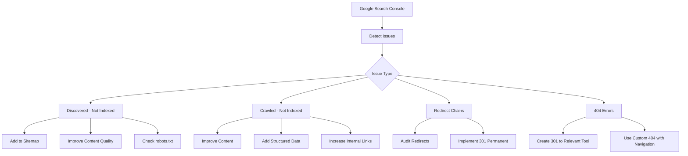
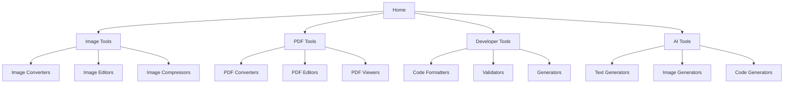
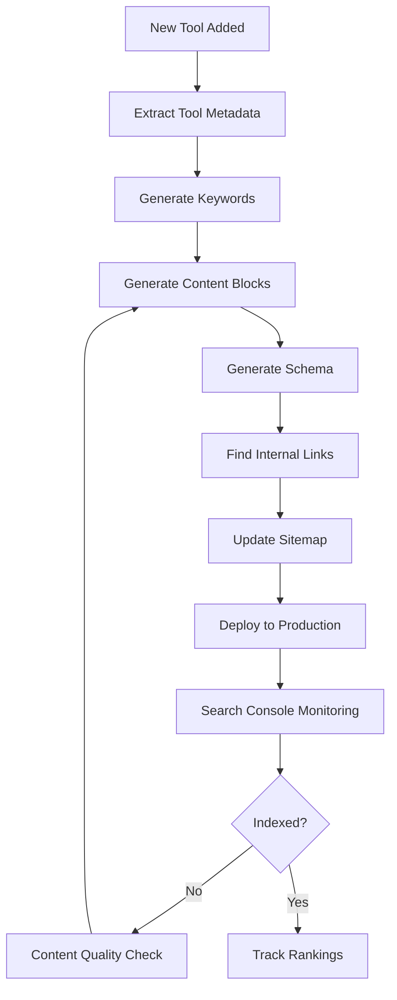

# Comprehensive SEO Optimization Plan
## IndiaToolkit.in - Utility Tools Website

**Project Scope:** 250+ tool pages | 19 categories | Scaling to 500+ pages
**Target:** Maximum Google indexing, ranking, and traffic growth

---

## Executive Summary

This plan addresses all 14 SEO optimization areas for IndiaToolkit.in. The site has a solid foundation (robots.txt, sitemap, basic metadata, schema utilities) but requires significant enhancements to achieve competitive ranking against tools like smallseotools, ilovepdf, and img2go.

**Current Strengths:**
- ✅ robots.txt properly configured
- ✅ Dynamic sitemap generation
- ✅ Schema utilities exist
- ✅ Basic SEO metadata on pages
- ✅ 250+ tools with category structure

**Critical Gaps:**
- ⚠️ Thin content (no 500-1000 word pages)
- ⚠️ Generic SEO content generation
- ⚠️ Weak internal linking
- ⚠️ No HowTo schema implementation
- ⚠️ No category page content expansion
- ⚠️ No backlink strategy

---

## 1. Technical SEO Audit & Fixes

### Crawl Issues Detection & Resolution


```mermaid
flowchart TD
    A[Google Search Console] --> B[Detect Issues]
    B --> C{Issue Type}
    C --> D[Discovered - Not Indexed]
    C --> E[Crawled - Not Indexed]
    C --> F[Redirect Chains]
    C --> G[404 Errors]
    
    D --> D1[Add to Sitemap]
    D --> D2[Improve Content Quality]
    D --> D3[Check robots.txt]
    
    E --> E1[Improve Content]
    E --> E2[Add Structured Data]
    E --> E3[Increase Internal Links]
    
    F --> F1[Audit Redirects]
    F --> F2[Implement 301 Permanent]
    
    G --> G1[Create 301 to Relevant Tool]
    G --> G2[Use Custom 404 with Navigation]
```

### Fix Strategy

#### "Discovered – Currently Not Indexed" Issues

| Cause | Solution | Priority |
|-------|----------|----------|
| Thin content | Expand to 500-1000+ words | 🔴 High |
| No internal links | Build internal linking network | 🔴 High |
| Low URL discovery | Add to sitemap with higher priority | 🟡 Medium |
| No canonical tag | Ensure self-referencing canonical | 🟡 Medium |

#### "Crawled – Currently Not Indexed" Issues

| Cause | Solution | Priority |
|-------|----------|----------|
| Low quality content | Rewrite with unique value | 🔴 High |
| Duplicate content | Add canonical + unique content | 🔴 High |
| Too many pages | Use pagination + canonical on series | 🟡 Medium |
| Site speed | Optimize Core Web Vitals | 🟡 Medium |

### Redirect Chain Audit

```typescript
// lib/redirect-auditor.ts
interface RedirectCheck {
  source: string;
  destination: string;
  statusCode: number;
  chain: string[];
  issues: string[];
}

export async function auditRedirects(): Promise<RedirectCheck[]> {
  // Check common redirect patterns
  const redirectPatterns = [
    { from: '/old-tool', to: '/tool/new-tool' },
    { from: '/category/old', to: '/category/new' },
  ];
  
  // Implement chain detection
  // Flag any 302 (should be 301 for permanence)
  // Flag chains longer than 2 hops
}
```

### Broken Links & 404 Handling

```typescript
// Custom 404 page with SEO recovery
export default function Custom404() {
  return (
    <div>
      <h1>Tool Not Found</h1>
      <p>You might be looking for:</p>
      {/* Related tools suggestions */}
      <PopularTools />
      <AllCategories />
    </div>
  );
}
```

### Robots.txt Optimization

```txt
# Current (Good - keep as is)
User-agent: *
Allow: /
Disallow: /private/
Disallow: /api/
Disallow: /*?*  # Query params

# Add for better crawling
Sitemap: https://www.indiatoolkit.in/sitemap.xml
Sitemap: https://www.indiatoolkit.in/sitemap-tools.xml
Sitemap: https://www.indiatoolkit.in/sitemap-categories.xml

# Crawl-delay for heavy sites (optional)
Crawl-delay: 1
```

### Core Web Vitals Optimization

| Metric | Target | Current Status | Fix |
|--------|--------|----------------|-----|
| LCP | < 2.5s | Need audit | Optimize images, use CDN |
| FID | < 100ms | Need audit | Reduce JS blocking |
| CLS | < 0.1 | Need audit | Set image dimensions |

```typescript
// next.config.ts - Image optimization
module.exports = {
  images: {
    formats: ['image/avif', 'image/webp'],
    deviceSizes: [640, 750, 828, 1080, 1200],
    minimumCacheTTL: 60 * 60 * 24, // 1 day
  },
  // Enable compression
  compress: true,
};
```

---

## 2. Enhanced Tool Page SEO Template

### Complete Tool Page Structure

```tsx
// app/tool/[slug]/page.tsx - Enhanced Template

export default async function ToolPage({ params }) {
  const tool = await getToolBySlug(params.slug);
  
  return (
    <div>
      {/* 1. Breadcrumb (for SEO + UX) */}
      <Breadcrumb items={[
        { name: 'Home', url: '/' },
        { name: tool.categoryName, url: `/category/${tool.categorySlug}` },
        { name: tool.name, url: `/tool/${tool.slug}` }
      ]} />
      
      {/* 2. H1 - Primary SEO Element */}
      <h1>{tool.seo.title}</h1>
      
      {/* 3. Tool Interface - Above the Fold */}
      <div className="tool-interface">
        <ToolRenderer tool={tool} />
      </div>
      
      {/* 4. SEO Content Section - 500-1000 words */}
      <SeoContent tool={tool} />
      
      {/* 5. How-to-Use Section */}
      <HowToUse tool={tool} />
      
      {/* 6. Benefits Section */}
      <BenefitsSection tool={tool} />
      
      {/* 7. FAQ Section */}
      <FaqSection faqs={tool.faqs} />
      
      {/* 8. Internal Linking Block */}
      <InternalLinks 
        related={tool.relatedTools}
        category={tool.categoryTools}
        popular={tool.popularTools}
      />
    </div>
  );
}
```

### SEO Content Section Component

```tsx
// components/seo/ToolSeoContent.tsx

interface Props {
  tool: Tool;
  content: {
    introduction: string;
    howToUse: string;
    benefits: string[];
  };
}

export function ToolSeoContent({ tool, content }: Props) {
  return (
    <section className="seo-content" id="seo-content">
      {/* Introduction */}
      <article className="intro-section">
        <h2>About {tool.name}</h2>
        <div dangerouslySetInnerHTML={{ 
          __html: content.introduction 
        }} />
      </article>
      
      {/* How to Use with numbered steps */}
      <article className="how-to-section">
        <h2>How to Use {tool.name}</h2>
        <ol>
          {content.steps.map((step, i) => (
            <li key={i}>{step}</li>
          ))}
        </ol>
      </article>
      
      {/* Benefits */}
      <article className="benefits-section">
        <h2>Benefits of Using {tool.name}</h2>
        <ul>
          {content.benefits.map((benefit, i) => (
            <li key={i}>{benefit}</li>
          ))}
        </ul>
      </article>
    </section>
  );
}
```

---

## 3. Dynamic SEO Content Generation System

### Enhanced Content Generator

```typescript
// lib/advanced-seo-generator.ts

interface KeywordData {
  primary: string;
  secondary: string[];
  longTail: string[];
}

interface SeoContentBlock {
  introduction: string;      // 150-200 words
  howToUse: string;          // 200-300 words
  benefits: string;         // 150-200 words
  faqs: FaqItem[];          // 5-8 questions
  relatedTools: string[];   // 6-10 tools
  steps: string[];          // 4-6 steps
}

export function generateAdvancedSeoContent(
  tool: Tool, 
  keywords: KeywordData
): SeoContentBlock {
  
  // Dynamic introduction based on tool type
  const introduction = generateIntroduction(tool, keywords);
  
  // Step-by-step usage guide
  const steps = generateSteps(tool);
  
  // Type-specific benefits
  const benefits = generateBenefits(tool, keywords);
  
  // Targeted FAQs
  const faqs = generateFaqs(tool, keywords);
  
  // Related tools discovery
  const relatedTools = findRelatedTools(tool);
  
  return {
    introduction,
    howToUse: stepsToParagraph(steps),
    benefits,
    faqs,
    relatedTools,
    steps
  };
}

function generateIntroduction(tool: Tool, keywords: KeywordData): string {
  const templates = {
    calculator: `Our free online ${keywords.primary} helps you perform accurate calculations instantly. Whether you're a student, professional, or just need quick calculations, this ${tool.name} tool provides reliable results without any cost. Unlike mobile apps or software downloads, our ${keywords.primary} works directly in your browser on any device.`,
    
    converter: `Convert your files quickly and easily with our free online ${keywords.primary}. This powerful ${tool.name} tool supports multiple formats and delivers high-quality output. No software installation required - just upload your files and convert instantly. Perfect for personal and professional use.`,
    
    generator: `Create professional-quality content with our free ${keywords.primary}. This AI-powered ${tool.name} tool helps you generate ${keywords.secondary[0]} in seconds. Whether you need content for websites, social media, or marketing, our tool delivers results.`,
    
    default: `Use our free online ${keywords.primary} to simplify your ${tool.category} tasks. This ${tool.name} tool is completely free, requires no registration, and works on all devices. Get instant results with our easy-to-use interface.`
  };
  
  return templates[tool.type] || templates.default;
}

function generateSteps(tool: Tool): string[] {
  const stepsByType = {
    calculator: [
      `Enter your values in the input fields provided`,
      `Select any additional options or settings you need`,
      `Click the "Calculate" button to get instant results`,
      `View your results and use them as needed`,
      `Click "Reset" to start a new calculation`
    ],
    converter: [
      `Click "Choose File" or drag and drop your file`,
      `Select the output format you need`,
      `Click "Convert" to start the process`,
      `Download your converted file instantly`,
      `Repeat for additional files if needed`
    ],
    generator: [
      `Enter your text or content in the input field`,
      `Customize options like tone, length, and style`,
      `Click "Generate" to create your content`,
      `Review and edit the generated output`,
      `Copy or download your final content`
    ]
  };
  
  return stepsByType[tool.type] || stepsByType.default;
}
```

---

## 4. Keyword Optimization Framework

### Keyword Research Template

```typescript
// lib/keyword-research.ts

interface ToolKeywordData {
  toolId: string;
  toolName: string;
  toolType: string;
  category: string;
  keywords: {
    primary: string;
    primaryVolume: number;
    secondary: {
      keyword: string;
      volume: number;
    }[];
    longTail: {
      keyword: string;
      volume: number;
    }[];
  };
}

// Example: PNG to JPG Converter
export const pngToJpgKeywords: ToolKeywordData = {
  toolId: "png-to-jpg",
  toolName: "PNG to JPG Converter",
  toolType: "converter",
  category: "image-tools",
  keywords: {
    primary: "convert png to jpg",
    primaryVolume: 74000, // Monthly searches
    secondary: [
      { keyword: "png to jpg online", volume: 22200 },
      { keyword: "free png converter", volume: 8100 },
      { keyword: "png image converter", volume: 6600 },
      { keyword: "batch png to jpg", volume: 4400 },
      { keyword: "png to jpg without losing quality", volume: 3600 }
    ],
    longTail: [
      { keyword: "convert png to jpg without losing quality", volume: 3600 },
      { keyword: "png to jpg online free tool", volume: 2900 },
      { keyword: "how to convert png to jpg on mac", volume: 1600 },
      { keyword: "convert multiple png to jpg batch", volume: 1300 },
      { keyword: "png to jpg converter download", volume: 1000 }
    ]
  }
};

// Generate keywords for any tool
export function generateKeywords(tool: Tool): ToolKeywordData {
  const baseName = tool.name.toLowerCase().replace(/online|free|tool/g, '').trim();
  const action = getActionForType(tool.type);
  
  return {
    toolId: tool.id,
    toolName: tool.name,
    toolType: tool.type,
    category: tool.category,
    keywords: {
      primary: `${action} ${baseName}`,
      primaryVolume: estimateVolume(tool.type),
      secondary: generateSecondaryKeywords(baseName, tool.type),
      longTail: generateLongTailKeywords(baseName, tool.type)
    }
  };
}
```

### Keyword Placement Strategy

| Element | Primary Keyword | Secondary Keywords | Long-tail |
|---------|----------------|-------------------|-----------|
| H1 | ✅ Exact match | | |
| Title | ✅ + modifiers | ✅ | ✅ |
| Meta Description | ✅ | ✅ | ✅ |
| First 100 words | ✅ | ✅ | |
| Headings (H2) | ✅ | ✅ | |
| Content | 2-3% density | 1-2% | ✅ |
| Alt text | ✅ | | |
| URL | ✅ (slug) | | |

---

## 5. Title & Meta Optimization

### Title Templates by Tool Type

```typescript
// lib/meta-optimizer.ts

interface MetaTemplates {
  calculator: string;
  converter: string;
  generator: string;
  analyzer: string;
  default: string;
}

export const titleTemplates: MetaTemplates = {
  calculator: "{name} - Free Online Calculator | India Toolkit",
  converter: "Free {name} - Convert {from} to {to} Online",
  generator: "Free {name} - Generate {output} Instantly",
  analyzer: "Free {name} - Analyze {subject} Online",
  default: "{name} - Free Online Tool | India Toolkit"
};

export const descriptionTemplates = {
  calculator: "Use our free {name} to perform {category} calculations instantly. No registration required. Get accurate results for {useCases}. Try now!",
  converter: "Convert {from} to {to} for free online. Fast, secure, no installation required. {additionalBenefits}. Start converting now!",
  generator: "Generate {output} with our free AI-powered {name}. Create {useCases} in seconds. No signup needed. Try our {name} today!",
  analyzer: "Analyze {subject} with our free {name}. Get detailed insights for {useCases}. Completely free, works in browser. Start analyzing now!"
};

// Example output
const exampleTitle = generateMetaTitle("PNG to JPG Converter", "converter");
// "Convert PNG to JPG Online Free - Fast Image Converter | India Toolkit"

const exampleDescription = generateMetaDescription("PNG to JPG Converter", "converter");
// "Convert PNG to JPG for free online. Fast, secure, no installation required. 
//  Batch conversion available. Start converting now!"
```

### OG & Twitter Card Templates

```typescript
export const socialTemplates = {
  og: {
    title: "{name} - Free Online Tool",
    description: "Use {name} for free. {benefit}. No signup required.",
    type: "website"
  },
  twitter: {
    card: "summary_large_image",
    title: "{name} - Free Tool",
    description: "{benefit}. Use now!"
  }
};
```

---

## 6. Structured Data Implementation

### Complete Schema for Tool Pages

```typescript
// lib/schema-generator.ts

interface ToolSchemaConfig {
  tool: Tool;
  keywords: KeywordData;
  category: Category;
  faqs: FaqItem[];
  steps: string[];
  relatedTools: Tool[];
}

export function generateCompleteSchema(config: ToolSchemaConfig) {
  const schemas = [
    // 1. SoftwareApplication Schema
    generateSoftwareSchema(config.tool),
    
    // 2. FAQ Schema (if 3+ FAQs)
    config.faqs.length >= 3 ? generateFaqSchema(config.faqs) : null,
    
    // 3. HowTo Schema (for tool usage)
    generateHowToSchema({
      name: `How to Use ${config.tool.name}`,
      description: `Step by step guide to using ${config.tool.name}`,
      steps: config.steps.map((step, i) => ({
        name: `Step ${i + 1}`,
        text: step
      })),
      tool: config.tool.name
    }),
    
    // 4. Breadcrumb Schema
    generateBreadcrumbSchema([
      { name: "Home", url: "/" },
      { name: config.category.name, url: `/category/${config.category.slug}` },
      { name: config.tool.name, url: `/tool/${config.tool.slug}` }
    ]),
    
    // 5. ItemList Schema (for related tools)
    generateItemListSchema("Related Tools", config.relatedTools)
  ];
  
  return schemas.filter(Boolean);
}

// Render in Next.js metadata
export function generateJsonLd(config: ToolSchemaConfig) {
  const schemas = generateCompleteSchema(config);
  return JSON.stringify(schemas);
}
```

### Example Output

```json
{
  "@context": "https://schema.org",
  "@graph": [
    {
      "@type": "SoftwareApplication",
      "name": "PNG to JPG Converter",
      "description": "Convert PNG images to JPG format online for free",
      "url": "https://www.indiatoolkit.in/tool/png-to-jpg",
      "applicationCategory": "UtilityApplication",
      "operatingSystem": "Web Browser",
      "offers": {
        "@type": "Offer",
        "price": "0",
        "priceCurrency": "USD"
      }
    },
    {
      "@type": "HowTo",
      "name": "How to Use PNG to JPG Converter",
      "step": [
        { "@type": "HowToStep", "position": 1, "name": "Choose File", "text": "Click Choose File or drag and drop your PNG image" },
        { "@type": "HowToStep", "position": 2, "name": "Select Format", "text": "Select JPG as your output format" },
        { "@type": "HowToStep", "position": 3, "name": "Convert", "text": "Click Convert to start the conversion process" },
        { "@type": "HowToStep", "position": 4, "name": "Download", "text": "Download your converted JPG image" }
      ]
    },
    {
      "@type": "FAQPage",
      "mainEntity": [
        {
          "@type": "Question",
          "name": "How do I convert PNG to JPG?",
          "acceptedAnswer": { "@type": "Answer", "text": "Upload your PNG file, select JPG as output format, and click Convert." }
        }
      ]
    }
  ]
}
```

---

## 7. Internal Linking System

### Smart Internal Linking Architecture

```typescript
// lib/internal-linker.ts

interface LinkContext {
  currentTool: Tool;
  category: Category;
  allTools: Tool[];
}

export function generateInternalLinks(context: LinkContext) {
  const { currentTool, category, allTools } = context;
  
  return {
    // Related Tools (same category)
    related: getRelatedTools(currentTool, allTools, 6),
    
    // Same Category Tools
    categoryTools: getCategoryTools(currentTool, allTools, 8),
    
    // Popular Tools (across site)
    popular: getPopularTools(allTools, 6),
    
    // Trending Tools
    trending: getTrendingTools(allTools, 4),
    
    // Complementary Tools (different category)
    complementary: getComplementaryTools(currentTool, allTools, 4)
  };
}

// Algorithm for related tools
function getRelatedTools(current: Tool, all: Tool[], limit: number): Tool[] {
  return all
    .filter(t => 
      t.id !== current.id && 
      (t.category === current.category || hasKeywordOverlap(t, current))
    )
    .sort((a, b) => calculateRelevanceScore(a, current) - calculateRelevanceScore(b, current))
    .slice(0, limit);
}
```

### Internal Link Block Component

```tsx
// components/seo/InternalLinkBlock.tsx

export function InternalLinkBlock({ links }: { links: LinkData }) {
  return (
    <aside className="internal-links">
      {/* Related Tools Section */}
      <section>
        <h3>Related {links.category.name} Tools</h3>
        <ul className="link-grid">
          {links.related.map(tool => (
            <li key={tool.id}>
              <Link href={`/tool/${tool.slug}`}>
                {tool.name}
              </Link>
            </li>
          ))}
        </ul>
      </section>
      
      {/* Popular Tools */}
      <section>
        <h3>Popular Tools</h3>
        <ul>
          {links.popular.map(tool => (
            <li key={tool.id}>
              <Link href={`/tool/${tool.slug}`}>
                {tool.name}
              </Link>
            </li>
          ))}
        </ul>
      </section>
      
      {/* Cross-category Links */}
      <section>
        <h3>Explore More Tools</h3>
        <ul className="category-links">
          {links.complementary.map(tool => (
            <li key={tool.id}>
              <Link href={`/tool/${tool.slug}`}>
                {tool.name}
              </Link>
            </li>
          ))}
        </ul>
      </section>
    </aside>
  );
}
```

---

## 8. Tool Category Architecture

### Category Page SEO Structure

```tsx
// app/category/[slug]/page.tsx - Enhanced

export async function generateMetadata({ params }): Promise<Metadata> {
  const category = getCategoryBySlug(params.slug);
  const tools = getToolsByCategory(params.slug);
  
  return {
    title: `${category.name} Tools - ${tools.length}+ Free Online Tools | India Toolkit`,
    description: `${category.description} Browse our collection of ${tools.length}+ free ${category.name.toLowerCase()} tools. Perfect for ${category.useCases}. No registration required.`,
    keywords: [
      `${category.name.toLowerCase()} tools`,
      'free online tools',
      'no registration required',
      ...tools.slice(0, 10).map(t => t.name.toLowerCase())
    ]
  };
}

export default function CategoryPage({ params }) {
  const category = getCategoryBySlug(params.slug);
  const tools = getToolsByCategory(params.slug);
  
  return (
    <div>
      <h1>{category.seoTitle || `${category.name} Tools`}</h1>
      <CategoryIntro content={category.fullDescription} />
      
      <ToolGrid tools={tools} />
      
      {/* Category FAQ */}
      <CategoryFaqs category={category} />
      
      {/* Related Categories */}
      <RelatedCategories current={category} />
    </div>
  );
}
```

### Category Hierarchy


```mermaid
graph TD
    A[Home] --> B[Image Tools]
    A --> C[PDF Tools]
    A --> D[Developer Tools]
    A --> E[AI Tools]
    
    B --> B1[Image Converters]
    B --> B2[Image Editors]
    B --> B3[Image Compressors]
    
    C --> C1[PDF Converters]
    C --> C2[PDF Editors]
    C --> C3[PDF Viewers]
    
    D --> D1[Code Formatters]
    D --> D2[Validators]
    D --> D3[Generators]
    
    E --> E1[Text Generators]
    E --> E2[Image Generators]
    E --> E3[Code Generators]
```

---

## 9. Content Expansion Strategy

### Blog Topics by Category

| Category | Blog Topic Ideas |
|----------|------------------|
| Image Tools | "How to Convert PNG to JPG Without Losing Quality" |
| | "Best Free Image Converter Tools in 2024" |
| | "How to Resize Images Without Losing Quality" |
| PDF Tools | "How to Merge PDF Files Online for Free" |
| | "Best PDF Compressor Tools to Reduce File Size" |
| Developer | "Essential Developer Tools Every Programmer Needs" |
| | "How to Format JSON Like a Pro" |
| AI Tools | "Best AI Writing Tools for Content Creators" |
| | "How to Generate AI Images for Free" |
| Calculators | "Understanding Compound Interest Calculations" |
| | "How to Calculate BMI Correctly" |

### Content-Tool Linking

```tsx
// components/blog/BlogPost.tsx

export function BlogPost({ post }: { post: BlogPost }) {
  return (
    <article>
      <h1>{post.title}</h1>
      <div className="content">
        {post.content}
      </div>
      
      {/* Contextual tool recommendations */}
      <ToolRecommendations 
        tools={findRelatedToolsForBlog(post)}
        context={post.category}
      />
    </article>
  );
}
```

---

## 10. Backlink Growth Strategy

### Backlink Acquisition Channels

```typescript
// lib/backlink-strategy.ts

const backlinkChannels = {
  directories: [
    { name: "Product Hunt", url: "https://producthunt.com", category: "launch" },
    { name: "G2", url: "https://g2.com", category: "reviews" },
    { name: "Capterra", url: "https://capterra.com", category: "reviews" },
    { name: "SaaS Worthy", url: "https://saasworthy.com", category: "directory" },
    { name: "AlternativeTo", url: "https://alternativeto.net", category: "alternatives" }
  ],
  
  communities: [
    { name: "Reddit r/webdev", url: "https://reddit.com/r/webdev", type: "discussion" },
    { name: "Reddit r/tools", url: "https://reddit.com/r/tools", type: "discussion" },
    { name: "DEV Community", url: "https://dev.to", type: "blog" },
    { name: "Hashnode", url: "https://hashnode.com", type: "blog" }
  ],
  
  contentFormats: [
    { type: "Guest Post", sites: ["moz.com", "hubspot.com", "semrush.com"] },
    { type: "Tool Review", sites: ["youtube.com", "blogger.com"] },
    { type: "Tutorial", sites: ["medium.com", "dev.to"] }
  ]
};
```

### Outreach Template

```
Subject: Free Tool for [Target Audience]

Hi [Name],

I noticed your recent post about [Topic]. Our team built a free [Tool Name] 
that might help your readers with [Problem].

Key features:
- [Feature 1]
- [Feature 2]  
- [Feature 3]

Would you be interested in trying it or including it in your resource list?

Best,
[Your Name]
IndiaToolkit.in
```

---

## 11. CTR Optimization

### Enhanced SERP Features

```typescript
// lib/serp-optimization.ts

interface SerpFeatures {
  richResults: ('faq' | 'howto' | 'review' | 'sitename')[];
  title优化: string;
  description优化: string;
  schema: object;
}

export function optimizeForCtr(
  tool: Tool, 
  keywords: KeywordData
): SerpFeatures {
  return {
    richResults: ['faq', 'howto'],
    
    // Title optimizations
    title优化: optimizeTitle(tool, keywords),
    
    // Description optimizations  
    description优化: optimizeDescription(tool, keywords),
    
    // Full schema
    schema: generateCompleteSchema(tool)
  };
}

function optimizeTitle(tool: Tool, keywords: KeywordData): string {
  const patterns = [
    // Pattern 1: Primary Keyword + Benefit
    `${keywords.primary} - Free Online Tool`,
    
    // Pattern 2: Tool Name + Action
    `Free ${tool.name} - ${keywords.primary}`,
    
    // Pattern 3: Best + Category
    `Best Free ${tool.category} Tools - ${tool.name}`
  ];
  
  // Test different patterns with CTR tracking
  return patterns[0]; // Default to first
}
```

### Structured Snippet Example

```
Title: PNG to JPG Converter - Convert Images Free | India Toolkit

Description: Convert PNG to JPG online for free. Fast, secure, no installation.
Supports batch conversion. Try our PNG to JPG tool now!

URL: https://www.indiatoolkit.in/tool/png-to-jpg

[SITELINKS]
├── Image Compressor
├── JPG to PNG
├── PDF to JPG
└── Image Resizer
```

---

## 12. Programmatic SEO System

### Automated Tool Page Generation

```typescript
// lib/programmatic-seo.ts

interface NewToolConfig {
  id: string;
  name: string;
  slug: string;
  category: string;
  type: 'calculator' | 'converter' | 'generator' | 'analyzer';
  inputs: InputConfig[];
  outputs: OutputConfig[];
}

// Auto-generate all SEO elements for new tools
export function generateProgrammaticSeo(config: NewToolConfig) {
  return {
    // 1. Metadata
    metadata: generateMetadata(config),
    
    // 2. Content
    content: generateContent(config),
    
    // 3. Schema
    schema: generateSchemas(config),
    
    // 4. Internal Links
    internalLinks: findInternalLinks(config),
    
    // 5. Sitemap Entry
    sitemapEntry: generateSitemapEntry(config)
  };
}

// Workflow for adding new tools
const newToolWorkflow = [
  "1. Add tool config to data/tools.ts",
  "2. Run: npm run generate-seo",
  "3. Auto-generates: metadata, content, schema, links",
  "4. Add to sitemap automatically",
  "5. Ready for indexing"
];
```

### Automated Content Generation Pipeline


```mermaid
flowchart TD
    A[New Tool Added] --> B[Extract Tool Metadata]
    B --> C[Generate Keywords]
    C --> D[Generate Content Blocks]
    D --> E[Generate Schema]
    E --> F[Find Internal Links]
    F --> G[Update Sitemap]
    G --> H[Deploy to Production]
    
    H --> I[Search Console Monitoring]
    I --> J{Indexed?}
    J -->|No| K[Content Quality Check]
    K --> D
    J -->|Yes| L[Track Rankings]
```

---

## 13. Implementation Priority Matrix

### Phase 1: Critical (Week 1-2)

| Task | Impact | Effort | Priority |
|------|--------|--------|----------|
| Expand tool content to 500+ words | 🔴 High | Medium | P1 |
| Fix generic SEO content | 🔴 High | Medium | P1 |
| Add HowTo schema to all tools | 🔴 High | Low | P1 |
| Improve internal linking | 🔴 High | High | P1 |

### Phase 2: Important (Week 3-4)

| Task | Impact | Effort | Priority |
|------|--------|--------|----------|
| Category page SEO | 🟡 Medium | Medium | P2 |
| FAQ expansion | 🟡 Medium | Medium | P2 |
| Title/meta optimization | 🟡 Medium | Low | P2 |
| CTR optimization | 🟡 Medium | Low | P2 |

### Phase 3: Growth (Month 2)

| Task | Impact | Effort | Priority |
|------|--------|--------|----------|
| Blog content strategy | 🟢 Long-term | High | P3 |
| Backlink outreach | 🟢 Long-term | High | P3 |
| Programmatic SEO system | 🟢 Long-term | High | P3 |

---

## 14. Key Performance Indicators

### SEO Success Metrics

| Metric | Current | Target | Timeline |
|--------|---------|--------|----------|
| Indexed Pages | ~250 | 500+ | 3 months |
| Indexed Rate | ? | 95%+ | 1 month |
| Average Position | ? | Top 10 | 6 months |
| Organic Traffic | ? | 100k/month | 6 months |
| CTR from SERP | ? | 5%+ | 3 months |
| Core Web Vitals Pass | ? | 90%+ | 1 month |

---

## Appendix: File Structure

```
/
├── app/
│   ├── tool/[slug]/
│   │   └── page.tsx          (Enhanced with full SEO content)
│   ├── category/[slug]/
│   │   └── page.tsx          (Enhanced category pages)
│   └── blog/
│       └── [slug]/page.tsx   (Content supporting tools)
├── components/
│   ├── seo/
│   │   ├── ToolSeoContent.tsx
│   │   ├── InternalLinkBlock.tsx
│   │   ├── FaqSection.tsx
│   │   └── HowToSection.tsx
│   └── home/                 (Homepage sections)
├── lib/
│   ├── advanced-seo-generator.ts   (New: Enhanced content)
│   ├── keyword-research.ts          (New: Keyword framework)
│   ├── meta-optimizer.ts            (New: Title/meta templates)
│   ├── schema-generator.ts          (Enhanced: Complete schemas)
│   ├── internal-linker.ts           (New: Smart linking)
│   ├── serp-optimization.ts         (New: CTR optimization)
│   ├── programmatic-seo.ts            (New: Auto-generation)
│   └── backlink-strategy.ts         (New: Outreach)
├── data/
│   ├── tools.ts            (Add seo field to all tools)
│   └── categories.ts       (Enhance with full descriptions)
└── plans/
    └── seo-implementation.md
```

---

*Document Version: 1.0*
*Last Updated: 2026-03-14*
*Next Review: After Phase 1 completion*

// Auto-generate all SEO elements for new tools
export function generateProgrammaticSeo(config: NewToolConfig) {
  return {
    // 1. Metadata
    metadata: generateMetadata(config),
    
    // 2. Content
    content: generateContent(config),
    
    // 3. Schema
    schema: generateSchemas(config),
    
    // 4. Internal Links
    internalLinks: findInternalLinks(config),
    
    // 5. Sitemap Entry
    sitemapEntry: generateSitemapEntry(config)
  };
}

// Workflow for adding new tools
const newToolWorkflow = [
  "1. Add tool config to data/tools.ts",
  "2. Run: npm run generate-seo",
  "3. Auto-generates: metadata, content, schema, links",
  "4. Add to sitemap automatically",
  "5. Ready for indexing"
];
```

### Automated Content Generation Pipeline


```mermaid
flowchart TD
    A[New Tool Added] --> B[Extract Tool Metadata]
    B --> C[Generate Keywords]
    C --> D[Generate Content Blocks]
    D --> E[Generate Schema]
    E --> F[Find Internal Links]
    F --> G[Update Sitemap]
    G --> H[Deploy to Production]
    
    H --> I[Search Console Monitoring]
    I --> J{Indexed?}
    J -->|No| K[Content Quality Check]
    K --> D
    J -->|Yes| L[Track Rankings]
```

---

## 13. Implementation Priority Matrix

### Phase 1: Critical (Week 1-2)

| Task | Impact | Effort | Priority |
|------|--------|--------|----------|
| Expand tool content to 500+ words | 🔴 High | Medium | P1 |
| Fix generic SEO content | 🔴 High | Medium | P1 |
| Add HowTo schema to all tools | 🔴 High | Low | P1 |
| Improve internal linking | 🔴 High | High | P1 |

### Phase 2: Important (Week 3-4)

| Task | Impact | Effort | Priority |
|------|--------|--------|----------|
| Category page SEO | 🟡 Medium | Medium | P2 |
| FAQ expansion | 🟡 Medium | Medium | P2 |
| Title/meta optimization | 🟡 Medium | Low | P2 |
| CTR optimization | 🟡 Medium | Low | P2 |

### Phase 3: Growth (Month 2)

| Task | Impact | Effort | Priority |
|------|--------|--------|----------|
| Blog content strategy | 🟢 Long-term | High | P3 |
| Backlink outreach | 🟢 Long-term | High | P3 |
| Programmatic SEO system | 🟢 Long-term | High | P3 |

---

## 14. Key Performance Indicators

### SEO Success Metrics

| Metric | Current | Target | Timeline |
|--------|---------|--------|----------|
| Indexed Pages | ~250 | 500+ | 3 months |
| Indexed Rate | ? | 95%+ | 1 month |
| Average Position | ? | Top 10 | 6 months |
| Organic Traffic | ? | 100k/month | 6 months |
| CTR from SERP | ? | 5%+ | 3 months |
| Core Web Vitals Pass | ? | 90%+ | 1 month |

---

## Appendix: File Structure

```
/
├── app/
│   ├── tool/[slug]/
│   │   └── page.tsx          (Enhanced with full SEO content)
│   ├── category/[slug]/
│   │   └── page.tsx          (Enhanced category pages)
│   └── blog/
│       └── [slug]/page.tsx   (Content supporting tools)
├── components/
│   ├── seo/
│   │   ├── ToolSeoContent.tsx
│   │   ├── InternalLinkBlock.tsx
│   │   ├── FaqSection.tsx
│   │   └── HowToSection.tsx
│   └── home/                 (Homepage sections)
├── lib/
│   ├── advanced-seo-generator.ts   (New: Enhanced content)
│   ├── keyword-research.ts          (New: Keyword framework)
│   ├── meta-optimizer.ts            (New: Title/meta templates)
│   ├── schema-generator.ts          (Enhanced: Complete schemas)
│   ├── internal-linker.ts           (New: Smart linking)
│   ├── serp-optimization.ts         (New: CTR optimization)
│   ├── programmatic-seo.ts            (New: Auto-generation)
│   └── backlink-strategy.ts         (New: Outreach)
├── data/
│   ├── tools.ts            (Add seo field to all tools)
│   └── categories.ts       (Enhance with full descriptions)
└── plans/
    └── seo-implementation.md
```

---

*Document Version: 1.0*
*Last Updated: 2026-03-14*
*Next Review: After Phase 1 completion*

