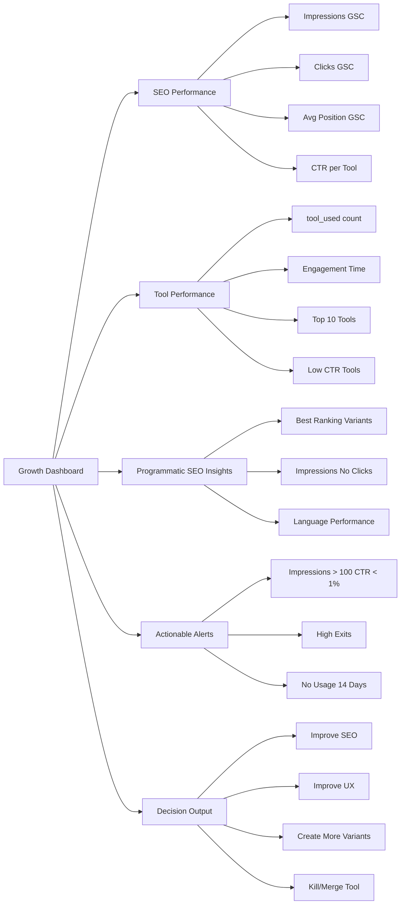

# India Toolkit - Programmatic SEO System Architecture

## Executive Summary

This document outlines the complete architecture for building a scalable, SEO-focused tools website called "indiatoolkit.in" with programmatic SEO capabilities, GA4 event tracking, and a growth dashboard combining GA4 + Google Search Console data.

---

## PART 1: PROGRAMMATIC SEO PAGE STRUCTURE

### URL Structure Design

```
Canonical Page: /tool/[tool-slug]
SEO Variants:
  /[tool-slug]-online
  /free-[tool-slug]
  /[tool-slug]-for-students
  /[tool-slug]-india
  /[tool-slug]-calculator
Language Versions:
  /hi/[tool-slug]
  /hi/[tool-slug]-online
```

### Database Model for SEO

```typescript
interface SEOToolData {
  // Core Tool Data
  tool_name: string;
  slug: string;
  category: string;
  primary_keyword: string;
  secondary_keywords: string[];
  intent_type: 'informational' | 'transactional';
  language: 'en' | 'hi';

  // SEO Variant Configuration
  seo_variant_type: 'canonical' | 'online' | 'free' | 'students' | 'india' | 'calculator';
  canonical_url: string;

  // Content Blocks (JSON)
  content_blocks: {
    h1: string;
    introduction: string;
    value_proposition: string;
    use_cases: string[];
    benefits: string[];
    cta_text: string;
  };

  // FAQ Blocks (JSON)
  faq_blocks: Array<{
    question: string;
    answer: string;
    variant_specific: boolean;
  }>;

  // Internal Linking
  internal_links: Array<{
    tool_slug: string;
    anchor_text: string;
    relevance_score: number;
  }>;

  // Performance Tracking
  impressions: number;
  clicks: number;
  avg_position: number;
  ctr: number;
  last_updated: string;
}
```

### Folder Structure

```
omnitools/
├── app/
│   ├── tool/
│   │   └── [slug]/
│   │       └── page.tsx                    # Canonical tool page
│   ├── seo-variants/
│   │   ├── [slug]-online/
│   │   │   └── page.tsx                    # Online variant
│   │   ├── free-[slug]/
│   │   │   └── page.tsx                    # Free variant
│   │   ├── [slug]-for-students/
│   │   │   └── page.tsx                    # Students variant
│   │   ├── [slug]-india/
│   │   │   └── page.tsx                    # India variant
│   │   └── [slug]-calculator/
│   │       └── page.tsx                    # Calculator variant
│   ├── hi/
│   │   ├── tool/
│   │   │   └── [slug]/
│   │   │       └── page.tsx                # Hindi canonical
│   │   └── seo-variants/
│   │       ├── [slug]-online/
│   │       │   └── page.tsx                # Hindi online variant
│   │       └── ...
│   └── analytics/
│       └── dashboard/
│           └── page.tsx                    # Growth Dashboard
├── lib/
│   ├── seo/
│   │   ├── variant-generator.ts            # Generate variant content
│   │   ├── content-rewriter.ts             # Rewrite content for variants
│   │   ├── canonical-manager.ts            # Manage canonical URLs
│   │   └── schema-generator.ts             # Generate JSON-LD schemas
│   ├── analytics/
│   │   ├── ga4-tracker.ts                  # GA4 event tracking
│   │   ├── gsc-fetcher.ts                  # GSC data fetching
│   │   └── growth-analyzer.ts              # Analyze growth metrics
│   └── data/
│       ├── seo-variants.json               # SEO variant configurations
│       └── content-templates.json          # Content templates
├── hooks/
│   ├── useGA4Events.ts                      # GA4 event hook
│   └── useSEOTracking.ts                   # SEO tracking hook
├── components/
│   ├── seo/
│   │   ├── VariantPageTemplate.tsx         # Reusable variant template
│   │   ├── FAQAccordion.tsx                 # FAQ component with schema
│   │   ├── BreadcrumbSchema.tsx             # Breadcrumb schema
│   │   └── ToolSchema.tsx                   # Tool/Product schema
│   ├── analytics/
│   │   ├── GrowthDashboard.tsx              # Main dashboard
│   │   ├── SEOPerformanceCard.tsx           # SEO metrics card
│   │   ├── ToolPerformanceCard.tsx          # Tool metrics card
│   │   ├── VariantInsightsCard.tsx         # Variant analysis
│   │   └── ActionableAlerts.tsx             # Alerts component
│   └── tools/
│       └── OnlineStopwatch.tsx             # Example tool
└── types/
    ├── seo.ts                               # SEO types
    └── analytics.ts                          # Analytics types
```

---

## PART 2: PERFECT TOOL PAGE TEMPLATE (SEO + UX)

### Page Structure

```mermaid
graph TD
    A[Tool Page] --> B[Above the Fold - LCP Optimized]
    A --> C[Tool Interaction Area]
    A --> D[SEO Content 600-900 words]
    A --> E[How to Use Steps]
    A --> F[FAQ Section with Schema]
    A --> G[Internal Linking]
    A --> H[Tech SEO Elements]

    B --> B1[H1 with Primary Keyword]
    B --> B2[1-2 Line Value Proposition]
    B --> B3[Tool UI Input to Output]
    B --> B4[No Heavy JS/Delayed Animations]

    C --> C1[Input Validation]
    C --> C2[Fast Execution]
    C --> C3[Copy Button]
    C --> C4[Download Option]
    C --> C5[Reset Option]
    C --> C6[GA4 Events]

    D --> D1[What is Tool Name]
    D --> D2[Why Use Tool Online]
    D --> D3[How Does Tool Work]
    D --> D4[Common Use Cases]
    D --> D5[Benefits]
    D --> D6[Who Should Use It]

    E --> E1[Step 1]
    E --> E2[Step 2]
    E --> E3[Step 3]
    E --> E4[Step 4]

    F --> F1[5 FAQs]
    F --> F2[Expandable UI]
    F --> F3[FAQ Schema JSON-LD]

    G --> G1[Related Tools 5 tools]
    G --> G2[Same Category]
    G --> G3[Adjacent Categories]

    H --> H1[Meta Title <=60 chars]
    H --> H2[Meta Description <=160 chars]
    H --> H3[OpenGraph + Twitter Cards]
    H --> H4[Breadcrumb Schema]
    H --> H5[Tool/Product Schema]
    H --> H6[FAQ Schema]
    H --> H7[Canonical URL]
```



### Template Component Structure

```typescript
// components/seo/VariantPageTemplate.tsx
interface VariantPageTemplateProps {
  tool: Tool;
  variant: SEOVariantType;
  language: 'en' | 'hi';
  seoContent: SEOContent;
  faqs: FAQ[];
  relatedTools: Tool[];
}

// Sections:
// 1. Hero Section (Above the Fold)
// 2. Tool Component (Dynamic Import)
// 3. SEO Content Section
// 4. How to Use Section
// 5. FAQ Section with Schema
// 6. Related Tools Section
// 7. Footer with Internal Links
```

---

## PART 3: PROGRAMMATIC CONTENT RULES

### Content Generation Logic

```typescript
// lib/seo/variant-generator.ts

interface ContentVariation {
  variant_type: SEOVariantType;
  h1_modifier: string;
  intro_template: string;
  example_context: string;
  cta_text: string;
  faq_modifiers: string[];
}

const CONTENT_VARIATIONS: Record<SEOVariantType, ContentVariation> = {
  canonical: {
    variant_type: 'canonical',
    h1_modifier: '',
    intro_template: '{tool_name} is a powerful online tool that helps users...',
    example_context: 'For example, if you need to...',
    cta_text: 'Start Using {tool_name}',
    faq_modifiers: []
  },
  online: {
    variant_type: 'online',
    h1_modifier: 'Online',
    intro_template: 'Use {tool_name} online directly in your browser without any downloads...',
    example_context: 'When working online, you can...',
    cta_text: 'Use {tool_name} Online Now',
    faq_modifiers: ['online', 'browser-based', 'no download']
  },
  free: {
    variant_type: 'free',
    h1_modifier: 'Free',
    intro_template: 'Get {tool_name} completely free with no hidden charges or subscriptions...',
    example_context: 'As a free tool, you can...',
    cta_text: 'Use Free {tool_name}',
    faq_modifiers: ['free', 'no cost', 'complimentary']
  },
  students: {
    variant_type: 'students',
    h1_modifier: 'for Students',
    intro_template: '{tool_name} is designed specifically for students to help with their studies...',
    example_context: 'Students can use this tool for...',
    cta_text: 'Start Learning with {tool_name}',
    faq_modifiers: ['students', 'education', 'learning', 'academic']
  },
  india: {
    variant_type: 'india',
    h1_modifier: 'India',
    intro_template: '{tool_name} is optimized for users in India with local features and support...',
    example_context: 'In India, this tool is useful for...',
    cta_text: 'Use {tool_name} in India',
    faq_modifiers: ['india', 'indian', 'local', 'regional']
  },
  calculator: {
    variant_type: 'calculator',
    h1_modifier: 'Calculator',
    intro_template: 'Use our {tool_name} calculator to get accurate results instantly...',
    example_context: 'For calculations, you can...',
    cta_text: 'Calculate with {tool_name}',
    faq_modifiers: ['calculate', 'calculation', 'compute']
  }
};
```

### Duplicate Content Prevention Rules

1. **Opening Paragraph**: Must be unique per variant (minimum 30% difference)
2. **Examples**: Must be context-specific to variant
3. **FAQs**: At least 3 unique FAQs per variant
4. **CTA Text**: Unique call-to-action per variant
5. **Tool Logic**: Identical across all variants (canonical)

### Content Uniqueness Algorithm

```typescript
function calculateContentSimilarity(text1: string, text2: string): number {
  // Jaccard similarity for content uniqueness check
  const words1 = new Set(text1.toLowerCase().split(/\s+/));
  const words2 = new Set(text2.toLowerCase().split(/\s+/));
  const intersection = new Set([...words1].filter(x => words2.has(x)));
  const union = new Set([...words1, ...words2]);
  return intersection.size / union.size;
}

// Threshold: < 0.7 (70% similarity) to avoid duplicate content penalty
```

---

## PART 4: GA4 EVENT TRACKING

### Event Types

```typescript
interface GA4Event {
  event_name: string;
  parameters: {
    tool_name: string;
    category: string;
    page_variant: string;
    language: string;
    [key: string]: string | number | boolean;
  };
}

// Events to track:
const GA4_EVENTS = {
  tool_view: 'tool_view',
  tool_used: 'tool_used',
  input_filled: 'input_filled',
  copy_clicked: 'copy_clicked',
  download_clicked: 'download_clicked',
  reset_clicked: 'reset_clicked',
  language_switched: 'language_switched'
};
```

### Event Tracking Hook

```typescript
// hooks/useGA4Events.ts
export function useGA4Events(tool: Tool, variant: SEOVariantType, language: string) {
  const trackEvent = (eventName: string, additionalParams = {}) => {
    if (typeof window !== 'undefined' && (window as any).gtag) {
      (window as any).gtag('event', eventName, {
        tool_name: tool.name,
        category: tool.category,
        page_variant: `${tool.slug}-${variant}`,
        language: language,
        ...additionalParams
      });
    }
  };

  return {
    trackToolView: () => trackEvent('tool_view'),
    trackToolUsed: () => trackEvent('tool_used'),
    trackInputFilled: (field: string) => trackEvent('input_filled', { field }),
    trackCopyClicked: () => trackEvent('copy_clicked'),
    trackDownloadClicked: () => trackEvent('download_clicked'),
    trackResetClicked: () => trackEvent('reset_clicked'),
    trackLanguageSwitched: (newLang: string) => trackEvent('language_switched', { new_language: newLang })
  };
}
```

### Event Configuration in GA4

```javascript
// Mark these as engagement events:
gtag('config', 'G-BBHVWNTSWB', {
  engagement_events: [
    'tool_view',
    'tool_used',
    'input_filled',
    'copy_clicked',
    'download_clicked',
    'reset_clicked',
    'language_switched'
  ],
  conversion_events: [
    'tool_used',
    'download_clicked'
  ]
});
```

---

## PART 5: GA4 + GSC GROWTH DASHBOARD

### Dashboard Architecture



### Data Model

```typescript
interface DashboardData {
  seo_performance: {
    total_impressions: number;
    total_clicks: number;
    avg_position: number;
    ctr: number;
    by_tool: Array<{
      tool_slug: string;
      tool_name: string;
      impressions: number;
      clicks: number;
      avg_position: number;
      ctr: number;
    }>;
  };

  tool_performance: {
    total_tool_uses: number;
    avg_engagement_time: number;
    top_tools: Array<{
      tool_slug: string;
      tool_name: string;
      usage_count: number;
      engagement_time: number;
    }>;
    low_ctr_tools: Array<{
      tool_slug: string;
      tool_name: string;
      impressions: number;
      clicks: number;
      ctr: number;
    }>;
  };

  programmatic_seo_insights: {
    variant_performance: Array<{
      variant_type: SEOVariantType;
      avg_impressions: number;
      avg_ctr: number;
      best_tools: string[];
    }>;
    language_performance: {
      en: { impressions: number; clicks: number; ctr: number };
      hi: { impressions: number; clicks: number; ctr: number };
    };
  };

  actionable_alerts: Array<{
    type: 'low_ctr' | 'high_exits' | 'no_usage';
    tool_slug: string;
    tool_name: string;
    severity: 'high' | 'medium' | 'low';
    message: string;
    recommendation: string;
  }>;

  decision_output: Array<{
    tool_slug: string;
    tool_name: string;
    action: 'improve_seo' | 'improve_ux' | 'create_variants' | 'kill_merge';
    reason: string;
    priority: 'high' | 'medium' | 'low';
  }>;
}
```

### API Endpoints

```typescript
// app/api/analytics/growth/route.ts
export async function GET(request: Request) {
  // Fetch GA4 data
  const ga4Data = await fetchGA4Data();

  // Fetch GSC data
  const gscData = await fetchGSCData();

  // Combine and analyze
  const dashboardData = analyzeGrowthData(ga4Data, gscData);

  return NextResponse.json(dashboardData);
}
```

---

## PART 6: PERFORMANCE & SCALE RULES

### Core Web Vitals Targets

| Metric | Target | Implementation |
|--------|--------|----------------|
| LCP | < 2.5s | Lazy load non-critical sections, optimize images, use dynamic imports |
| CLS | 0 | Reserve space for dynamic content, avoid layout shifts |
| INP | < 200ms | Optimize JavaScript execution, use web workers for heavy tasks |

### Performance Optimization Strategies

```typescript
// 1. Dynamic Imports for Tools
const ToolComponent = dynamic(() => import(`@/components/tools/${tool.componentName}`), {
  loading: () => <ToolSkeleton />,
  ssr: false
});

// 2. Lazy Load SEO Content
const SEOContent = dynamic(() => import('@/components/seo/SEOContentSection'), {
  loading: () => <ContentSkeleton />
});

// 3. Image Optimization
import Image from 'next/image';
<Image src={tool.image} alt={tool.name} loading="lazy" />

// 4. Code Splitting
import dynamic from 'next/dynamic';

// 5. Font Optimization
const inter = Inter({
  subsets: ['latin'],
  display: 'swap',
  preload: true
});
```

### Mobile-First Design

```css
/* Mobile-first CSS approach */
.tool-container {
  padding: 1rem;
}

@media (min-width: 768px) {
  .tool-container {
    padding: 2rem;
  }
}

@media (min-width: 1024px) {
  .tool-container {
    padding: 3rem;
  }
}
```

---

## PART 7: EXAMPLE IMPLEMENTATION - ONLINE STOPWATCH

### Tool Configuration

```typescript
// data/tools.ts - Add Online Stopwatch
{
  id: "online-stopwatch",
  name: "Online Stopwatch",
  slug: "online-stopwatch",
  description: "Measure time accurately with our free online stopwatch.",
  category: "productivity-tools",
  type: "calculator",
  icon: "Timer",
  componentName: "OnlineStopwatch",
  seo: {
    title: "Online Stopwatch - Free Timer Tool",
    description: "Use our free online stopwatch to measure time accurately. Perfect for sports, cooking, and productivity.",
    keywords: ["online stopwatch", "free stopwatch", "timer", "stopwatch online"]
  },
  faqs: [
    {
      question: "How accurate is the online stopwatch?",
      answer: "Our stopwatch uses the browser's high-precision timer API for millisecond accuracy."
    }
  ],
  isPopular: true
}
```

### SEO Variants Configuration

```typescript
// lib/data/seo-variants.json
{
  "online-stopwatch": {
    "canonical": {
      "h1": "Online Stopwatch",
      "title": "Online Stopwatch - Free Timer Tool | India Toolkit",
      "description": "Measure time accurately with our free online stopwatch. Perfect for sports, cooking, and productivity.",
      "canonical_url": "https://www.indiatoolkit.in/tool/online-stopwatch"
    },
    "online": {
      "h1": "Online Stopwatch",
      "title": "Online Stopwatch - Use in Browser | India Toolkit",
      "description": "Use our online stopwatch directly in your browser. No download required. Measure time instantly.",
      "canonical_url": "https://www.indiatoolkit.in/tool/online-stopwatch"
    },
    "free": {
      "h1": "Free Online Stopwatch",
      "title": "Free Online Stopwatch - No Cost Timer | India Toolkit",
      "description": "Get our free online stopwatch with no hidden charges. Measure time without any cost.",
      "canonical_url": "https://www.indiatoolkit.in/tool/online-stopwatch"
    },
    "students": {
      "h1": "Online Stopwatch for Students",
      "title": "Online Stopwatch for Students - Study Timer | India Toolkit",
      "description": "Perfect online stopwatch for students. Use for study sessions, exams, and time management.",
      "canonical_url": "https://www.indiatoolkit.in/tool/online-stopwatch"
    },
    "india": {
      "h1": "Online Stopwatch India",
      "title": "Online Stopwatch India - Local Timer Tool | India Toolkit",
      "description": "Online stopwatch optimized for users in India. Works perfectly with Indian time zones.",
      "canonical_url": "https://www.indiatoolkit.in/tool/online-stopwatch"
    }
  }
}
```

### Hindi Variant Configuration

```typescript
// lib/data/seo-variants-hi.json
{
  "online-stopwatch": {
    "canonical": {
      "h1": "ऑनलाइन स्टॉपवॉच",
      "title": "ऑनलाइन स्टॉपवॉच - मुफ्त टाइमर टूल | India Toolkit",
      "description": "हमारे मुफ्त ऑनलाइन स्टॉपवॉच के साथ सटीक रूप से समय मापें। खेल, खाना पकाने और उत्पादकता के लिए बिल्कुल सही।",
      "canonical_url": "https://www.indiatoolkit.in/hi/tool/online-stopwatch"
    },
    "online": {
      "h1": "ऑनलाइन स्टॉपवॉच",
      "title": "ऑनलाइन स्टॉपवॉच - ब्राउज़र में उपयोग करें | India Toolkit",
      "description": "हमारे ऑनलाइन स्टॉपवॉच को सीधे अपने ब्राउज़र में उपयोग करें। कोई डाउनलोड की आवश्यकता नहीं है।",
      "canonical_url": "https://www.indiatoolkit.in/hi/tool/online-stopwatch"
    }
  }
}
```

### Tool Component with GA4 Events

```typescript
// components/tools/OnlineStopwatch.tsx
"use client";

import { useState, useEffect, useRef } from 'react';
import { useGA4Events } from '@/hooks/useGA4Events';

interface OnlineStopwatchProps {
  tool: Tool;
  variant: SEOVariantType;
  language: string;
}

export default function OnlineStopwatch({ tool, variant, language }: OnlineStopwatchProps) {
  const [time, setTime] = useState(0);
  const [isRunning, setIsRunning] = useState(false);
  const [laps, setLaps] = useState<number[]>([]);
  const intervalRef = useRef<NodeJS.Timeout | null>(null);
  const startTimeRef = useRef<number>(0);

  const { trackToolUsed, trackResetClicked } = useGA4Events(tool, variant, language);

  useEffect(() => {
    if (isRunning) {
      intervalRef.current = setInterval(() => {
        setTime(Date.now() - startTimeRef.current);
      }, 10);
    } else {
      if (intervalRef.current) {
        clearInterval(intervalRef.current);
      }
    }
    return () => {
      if (intervalRef.current) {
        clearInterval(intervalRef.current);
      }
    };
  }, [isRunning]);

  const start = () => {
    if (!isRunning) {
      startTimeRef.current = Date.now() - time;
      setIsRunning(true);
      trackToolUsed();
    }
  };

  const stop = () => {
    setIsRunning(false);
  };

  const reset = () => {
    setIsRunning(false);
    setTime(0);
    setLaps([]);
    trackResetClicked();
  };

  const lap = () => {
    setLaps([...laps, time]);
  };

  const formatTime = (ms: number) => {
    const minutes = Math.floor(ms / 60000);
    const seconds = Math.floor((ms % 60000) / 1000);
    const centiseconds = Math.floor((ms % 1000) / 10);
    return `${minutes.toString().padStart(2, '0')}:${seconds.toString().padStart(2, '0')}.${centiseconds.toString().padStart(2, '0')}`;
  };

  return (
    <div className="stopwatch-container">
      <div className="time-display">{formatTime(time)}</div>
      <div className="controls">
        <button onClick={start} disabled={isRunning}>Start</button>
        <button onClick={stop} disabled={!isRunning}>Stop</button>
        <button onClick={lap} disabled={!isRunning}>Lap</button>
        <button onClick={reset}>Reset</button>
      </div>
      {laps.length > 0 && (
        <div className="laps">
          <h3>Laps</h3>
          {laps.map((lap, index) => (
            <div key={index}>Lap {index + 1}: {formatTime(lap)}</div>
          ))}
        </div>
      )}
    </div>
  );
}
```

---

## IMPLEMENTATION ROADMAP

### Phase 1: Core Infrastructure
1. Set up folder structure for SEO variants
2. Create SEO data types and interfaces
3. Implement variant content generator
4. Set up GA4 event tracking hooks

### Phase 2: Tool Page Template
1. Create reusable variant page template
2. Implement SEO content sections
3. Add FAQ accordion with schema
4. Integrate internal linking

### Phase 3: Programmatic SEO
1. Implement content variation logic
2. Create canonical URL management
3. Add language support (Hindi)
4. Generate SEO variant pages

### Phase 4: Analytics Dashboard
1. Set up GA4 data fetching
2. Set up GSC data fetching
3. Create growth dashboard UI
4. Implement actionable alerts

### Phase 5: Example Implementation
1. Create Online Stopwatch tool
2. Generate 3 SEO variants
3. Create 1 Hindi page
4. Test and validate

### Phase 6: Performance Optimization
1. Implement lazy loading
2. Optimize Core Web Vitals
3. Mobile-first design
4. Code splitting

---

## SUCCESS METRICS

### SEO Metrics
- Organic traffic growth: +50% in 3 months
- Average position improvement: Top 10 for 80% of tools
- CTR improvement: +20% average
- Index coverage: 100% of pages indexed

### Engagement Metrics
- Tool usage rate: +30%
- Average session duration: +25%
- Bounce rate: -15%
- Return visitor rate: +20%

### Technical Metrics
- LCP: < 2.5s for 95% of pages
- CLS: 0 for 100% of pages
- INP: < 200ms for 95% of interactions
- Mobile usability: 100% pass rate
