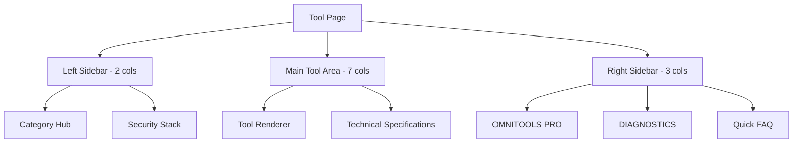
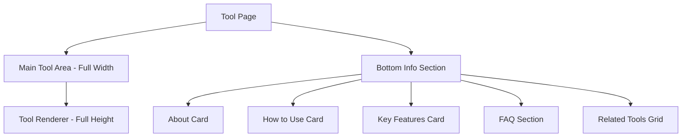

# Tool Page Restructure Plan

## Overview
The user wants to simplify the tool page layout by removing several sidebar sections and making the main tool area full-width/full-height, with info/details moved to the bottom.

## Current Structure Analysis

The current [`app/tool/[slug]/page.tsx`](app/tool/[slug]/page.tsx) has a 3-column layout:



## Sections to Remove

### 1. Category Hub (Lines 237-259)
- Shows related tools from the same category
- Contains links to other tools with star icons

### 2. Security Stack (Lines 261-275)
- Dark themed card showing: Local-First, Zero Latency, Private Buffer
- Uses ShieldCheck, Zap, and Info icons

### 3. OMNITOOLS PRO (Lines 279-298)
- Dark themed upgrade promotion card
- Shows UPGRADE NOW button linking to /pricing

### 4. DIAGNOSTICS (Lines 300-321)
- Shows Engine Velocity and Secure Buffer progress bars
- Displays Optimal and Locked status

### 5. Quick FAQ (Lines 323-333)
- Shows 2 FAQ items in the sidebar

## Proposed New Structure



## Implementation Details

### Layout Changes

**Current Layout:**
```jsx
<div className="flex flex-col lg:grid lg:grid-cols-12 gap-4 sm:gap-6 md:gap-8">
  <div className="lg:col-span-7">Main Tool</div>
  <div className="lg:col-span-2">Left Sidebar</div>
  <div className="lg:col-span-3">Right Sidebar</div>
</div>
```

**New Layout:**
```jsx
<div className="flex flex-col gap-4 sm:gap-6 md:gap-8">
  {/* Main Tool Area - Full Width */}
  <div className="w-full">
    <ToolRenderer tool={tool} />
  </div>
  
  {/* Bottom Info Section */}
  <div className="w-full">
    {/* About, How to Use, Features, FAQ */}
  </div>
</div>
```

### Sections to Keep and Reposition

1. **Tool Renderer** - Make full-width with increased min-height
2. **Technical Specifications** - Move below tool or integrate into bottom section
3. **SEO Content Cards** - Already at bottom, keep as-is
4. **FAQ Section** - Already at bottom, keep as-is
5. **Related Tools Grid** - Already at bottom, keep as-is

## Files to Modify

| File | Changes |
|------|---------|
| [`app/tool/[slug]/page.tsx`](app/tool/[slug]/page.tsx) | Remove sidebars, restructure layout |

## Code Changes Summary

### Remove Lines 236-334
This entire block contains the 3-column layout with sidebars:
- Lines 237-259: Category Hub
- Lines 261-275: Security Stack  
- Lines 279-298: OMNITOOLS PRO
- Lines 300-321: DIAGNOSTICS
- Lines 323-333: Quick FAQ

### Replace With Full-Width Tool Area
```jsx
{/* Full-Width Main Tool Area */}
<div className="w-full space-y-4 sm:space-y-6 md:space-y-8">
  <div className="relative group">
    <div 
      className="absolute -inset-1 rounded-2xl sm:rounded-[42px] blur-md opacity-10 group-hover:opacity-20 transition-opacity duration-700 hidden sm:block"
      style={{ backgroundColor: category?.color }}
    ></div>
    <div className="relative bg-white rounded-2xl sm:rounded-3xl md:rounded-4xl border border-slate-100 sm:border-2 shadow-lg sm:shadow-[0_40px_80px_-40px_rgba(0,0,0,0.1)] overflow-hidden min-h-screen">
      <div className="p-3 sm:p-4 md:p-6 lg:p-10">
        <ToolRenderer tool={tool} />
      </div>
    </div>
  </div>
</div>
```

## Benefits of This Change

1. **Cleaner UI** - Removes cluttered sidebar elements
2. **More Focus** - Tool becomes the primary focus
3. **Better Mobile Experience** - Full-width layout works better on mobile
4. **Simplified Code** - Less complex layout logic

## Visual Comparison

### Before
```
+----------+------------------------+------------+
| Category |                        | OMNITOOLS  |
| Hub      |     Main Tool          | PRO        |
|          |                        |            |
| Security |     Area               | DIAGNOSTICS|
| Stack    |                        |            |
|          |                        | Quick FAQ  |
+----------+------------------------+------------+
```

### After
```
+---------------------------------------------+
|                                             |
|              Main Tool Area                 |
|              Full Width/Height              |
|                                             |
+---------------------------------------------+
|  About  |  How to Use  |  Key Features     |
+---------------------------------------------+
|              FAQ Section                    |
+---------------------------------------------+
|              Related Tools                  |
+---------------------------------------------+
```

## Execution Steps

1. Switch to Code mode
2. Edit [`app/tool/[slug]/page.tsx`](app/tool/[slug]/page.tsx)
3. Remove the 3-column layout section (lines 195-335)
4. Replace with full-width tool area
5. Ensure bottom sections remain intact
6. Test the changes
